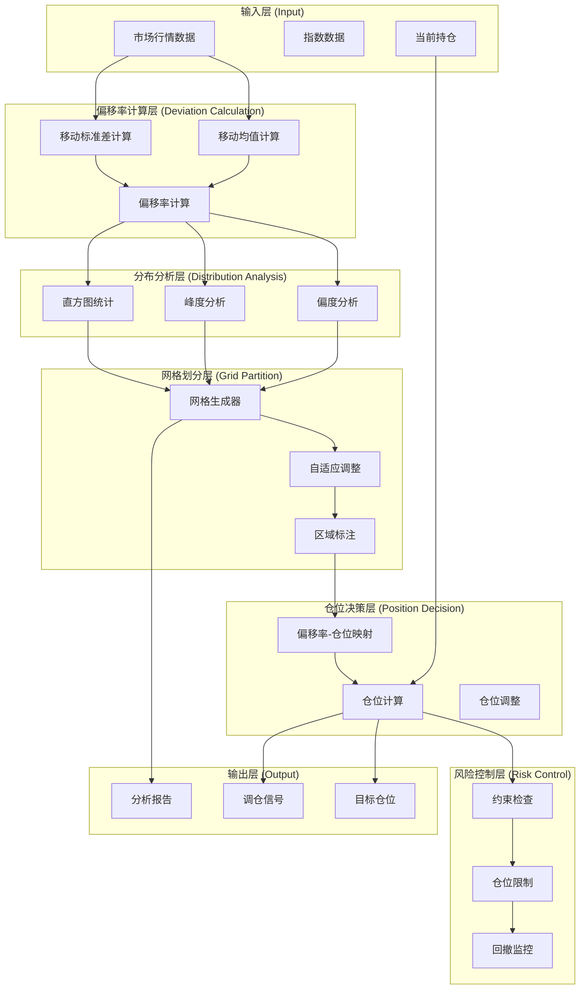

# A股动态仓位管理系统架构设计（基于偏移率分布网格）

> **项目名称**: Quant_A_Share_Position_Distribution  
> **定位**: 基于偏移率分布特征的A股动态仓位管理系统  
> **核心思路**: 通过分析投资标的价格相对均值的偏移率分布（偏度、峰度），动态划分仓位管理网格  
> **数据源**: Tushare Pro API  
> **更新日期**: 2026-01-22

---

## 1. 核心理念

### 1.1 基本概念

**偏移率 (Deviation Ratio, DR)**:
```
DR = (Price - MA) / MA
```
或使用标准差标准化：
```
DR_zscore = (Price - MA) / Std
```

其中 MA 为移动均值，Std 为移动标准差。

### 1.2 核心思路

1. **偏移率计算**: 对每个投资标的计算历史偏移率序列
2. **分布统计**: 分析偏移率序列的分布特征（均值、标准差、偏度、峰度）
3. **网格划分**: 根据分布的偏度和峰度动态划分仓位网格
4. **仓位决策**: 根据当前偏移率在网格中的位置决定仓位

### 1.3 分布特征与网格划分关系

| 分布特征 | 网格策略 | 说明 |
|----------|----------|------|
| 偏度 ≈ 0, 峰度 ≈ 3 | 等距网格 | 近似正态分布，用对称等距划分 |
| 正偏度 (右偏) | 非对称网格 | 右侧稀疏，左侧密集 |
| 负偏度 (左偏) | 非对称网格 | 左侧稀疏，右侧密集 |
| 峰度 > 3 (尖峰) | 中间密集网格 | 极端值较少，中间区域细分 |
| 峰度 < 3 (扁平) | 边缘密集网格 | 极端值较多，边缘区域细分 |

---

## 2. 系统架构总览



---

## 3. 核心模块设计

### 3.1 目录结构

```
Quant_A_Share_Position_Distribution/
├── config/
│   └── main.yaml                 # 主配置文件
│
├── data/                         # 数据目录
│   ├── raw/                      # 原始数据
│   ├── processed/                # 处理后数据
│   └── meta/                     # 元数据
│
├── src/
│   ├── __init__.py
│   │
│   ├── data_source/              # 数据获取层
│   │   ├── tushare_source.py     # Tushare API封装
│   │   └── datahub.py            # 统一数据入口
│   │
│   ├── deviation/                # 偏移率计算模块
│   │   ├── calculator.py         # 偏移率计算
│   │   ├── rolling_stats.py     # 滚动统计
│   │   └── normalization.py      # 标准化方法
│   │
│   ├── distribution/             # 分布分析模块
│   │   ├── stats_calculator.py   # 分布统计量计算
│   │   ├── shape_analyzer.py     # 形状分析（偏度、峰度）
│   │   ├── histogram.py          # 直方图统计
│   │   └── kde_estimator.py      # 核密度估计
│   │
│   ├── grid/                     # 网格划分模块
│   │   ├── base_grid.py          # 网格基类
│   │   ├── symmetric_grid.py     # 对称等距网格
│   │   ├── asymmetric_grid.py    # 非对称网格
│   │   ├── adaptive_grid.py      # 自适应网格
│   │   └── zone_manager.py       # 区域管理器
│   │
│   ├── position/                 # 仓位决策模块
│   │   ├── mapper.py             # 偏移率-仓位映射
│   │   ├── position_calculator.py # 仓位计算
│   │   ├── constraints.py        # 约束条件
│   │   └── optimizer.py          # 仓位优化
│   │
│   ├── risk/                     # 风险控制模块
│   │   ├── drawdown_control.py   # 回撤控制
│   │   ├── concentration.py      # 集中度控制
│   │   └── alert.py              # 风险预警
│   │
│   ├── execution/                # 执行模块
│   │   ├── order_generator.py    # 订单生成
│   │   ├── cost_estimator.py     # 成本估算
│   │   └── rebalancer.py         # 调仓执行
│   │
│   ├── analysis/                 # 分析模块
│   │   ├── distribution_report.py # 分布分析报告
│   │   ├── grid_report.py        # 网格分析报告
│   │   └── position_report.py    # 仓位分析报告
│   │
│   └── utils/                    # 工具模块
│       ├── logger.py
│       ├── config.py
│       └── io.py
│
├── scripts/                      # 脚本入口
│   ├── data/
│   │   └── update_data.py        # 数据更新
│   ├── analysis/
│   │   ├── calc_deviation.py     # 计算偏移率
│   │   ├── analyze_distribution.py # 分析分布
│   │   └── generate_grid.py      # 生成网格
│   ├── position/
│   │   ├── calculate_position.py # 计算仓位
│   │   └── run_rebalance.py      # 执行调仓
│   └── report/
│       └── generate_report.py    # 生成报告
│
├── notebooks/                    # 研究笔记
├── reports/                      # 输出报告
├── logs/                         # 日志
│
├── requirements.txt
├── architecture.md               # 本文档
└── README.md
```

---

## 4. 数据架构设计

### 4.1 数据需求

| 数据类型 | 用途 | 更新频率 |
|----------|------|----------|
| 日线行情 | 偏移率计算、滚动统计 | 每日 |
| 指数行情 | 基准偏移率 | 每日 |
| 行业指数 | 行业偏移率 | 每日 |
| 偏移率序列 | 分布分析 | 每日 |
| 网格配置 | 网格划分结果 | 周度/月度 |

### 4.2 数据存储规划

```
data/
├── raw/                          # 原始数据
│   ├── market/                   # 市场行情
│   │   └── daily/                # 日线数据
│   └── index/                    # 指数数据
│
├── processed/                    # 处理后数据
│   ├── deviation/                # 偏移率数据
│   │   ├── stock_deviation.parquet    # 个股偏移率
│   │   ├── index_deviation.parquet    # 指数偏移率
│   │   └── industry_deviation.parquet # 行业偏移率
│   │
│   ├── distribution/             # 分布统计数据
│   │   ├── dist_stats.parquet        # 分布统计量
│   │   └── histogram.parquet          # 直方图数据
│   │
│   ├── grid/                     # 网格数据
│   │   ├── grid_config.parquet       # 网格配置
│   │   └── zone_mapping.parquet      # 区域映射
│   │
│   └── position/                 # 仓位数据
│       ├── target_position.parquet  # 目标仓位
│       └── position_history.parquet # 仓位历史
│
└── meta/                         # 元数据
    ├── stock_basic.parquet       # 股票基础信息
    └── trade_cal.parquet         # 交易日历
```

### 4.3 偏移率数据格式

```python
# stock_deviation.parquet 格式
columns = [
    'trade_date',          # 交易日期
    'ts_code',             # 股票代码
    
    # 原始数据
    'close',               # 收盘价
    'ma',                  # 移动均值
    'std',                 # 移动标准差
    
    # 偏移率指标
    'dr_raw',              # 原始偏移率 (close - ma) / ma
    'dr_zscore',           # Z-score偏移率
    'dr_percentile',       # 百分位偏移率
    
    # 窗口参数
    'window_type',         # 窗口类型
    'window_size',         # 窗口大小
]
```

### 4.4 分布统计数据格式

```python
# dist_stats.parquet 格式
columns = [
    'as_of_date',          # 统计截止日期
    'ts_code',             # 标的代码
    
    # 统计窗口
    'stats_window',        # 统计窗口（天数）
    
    # 分布特征
    'mean',                # 均值
    'std',                 # 标准差
    'min',                 # 最小值
    'max',                 # 最大值
    
    # 形状特征
    'skewness',            # 偏度
    'kurtosis',            # 峰度
    'jarque_bera',         # Jarque-Bera检验
    'p_value',             # JB检验p值
    
    # 分位数
    'p05', 'p10', 'p25', 'p50', 'p75', 'p90', 'p95',
    
    # 分布类型判定
    'distribution_type',   # 'normal' / 'skewed_right' / 'skewed_left' / 'heavy_tail' / 'light_tail'
]
```

### 4.5 网格配置数据格式

```python
# grid_config.parquet 格式
columns = [
    'as_of_date',          # 网格生成日期
    'ts_code',             # 标的代码
    
    # 网格参数
    'grid_type',           # 网格类型: 'symmetric' / 'asymmetric' / 'adaptive'
    'n_zones',             # 区域数量
    'distribution_type',   # 依据的分布类型
    
    # 网格边界
    'zone_1_upper',        # 区域1上界
    'zone_2_lower', 'zone_2_upper',
    ...
    'zone_n_lower',        # 区域N下界
    
    # 仓位映射
    'zone_1_position',     # 区域1对应仓位
    'zone_2_position',
    ...
    'zone_n_position',
]
```

---

## 5. 核心模块详细设计

### 5.1 偏移率计算模块 (`src/deviation/`)

#### 5.1.1 偏移率计算器

```python
class DeviationCalculator:
    """偏移率计算器"""
    
    def __init__(self, window: int = 252, window_type: str = 'simple'):
        """
        Args:
            window: 移动窗口大小（默认252交易日=1年）
            window_type: 窗口类型 ('simple' / 'exponential' / 'adaptive')
        """
        self.window = window
        self.window_type = window_type
    
    def calculate(
        self, 
        prices: pd.Series
    ) -> pd.DataFrame:
        """
        计算偏移率
        
        Args:
            prices: 价格序列（索引为日期）
        
        Returns:
            DataFrame包含:
                - close: 收盘价
                - ma: 移动均值
                - std: 移动标准差
                - dr_raw: 原始偏移率 (close - ma) / ma
                - dr_zscore: Z-score偏移率
        """
        pass
    
    def calculate_zscore(self, prices: pd.Series) -> pd.Series:
        """计算Z-score偏移率"""
        pass
    
    def calculate_percentile(
        self, 
        prices: pd.Series,
        window: int = 1260
    ) -> pd.Series:
        """计算历史百分位偏移率"""
        pass
```

#### 5.1.2 滚动统计

```python
class RollingStats:
    """滚动统计计算"""
    
    def __init__(self, window: int):
        self.window = window
    
    def calculate_rolling_stats(
        self, 
        prices: pd.Series
    ) -> pd.DataFrame:
        """
        计算滚动统计量
        
        Returns:
            DataFrame包含:
                - ma: 移动平均
                - std: 移动标准差
                - rolling_skew: 滚动偏度
                - rolling_kurt: 滚动峰度
        """
        pass
```

---

### 5.2 分布分析模块 (`src/distribution/`)

#### 5.2.1 分布统计量计算

```python
class DistributionStats:
    """分布统计量计算"""
    
    def calculate_full_stats(
        self, 
        deviation_series: pd.Series,
        window: int = 252
    ) -> dict:
        """
        计算完整的分布统计量
        
        Returns:
            {
                'mean': float,
                'std': float,
                'min': float,
                'max': float,
                'median': float,
                'skewness': float,      # 偏度
                'kurtosis': float,      # 峰度
                'jarque_bera': float,   # JB统计量
                'p_value': float,       # JB检验p值
                'is_normal': bool,      # 是否符合正态分布
                'quantiles': dict,      # 分位数
            }
        """
        pass
```

#### 5.2.2 分布形状分析

```python
class ShapeAnalyzer:
    """分布形状分析器"""
    
    def analyze_distribution_shape(
        self, 
        stats: dict
    ) -> dict:
        """
        分析分布形状
        
        Returns:
            {
                'skewness_type': 'symmetric' / 'right_skewed' / 'left_skewed',
                'kurtosis_type': 'mesokurtic' / 'leptokurtic' / 'platykurtic',
                'distribution_type': 'normal' / 'skewed_right' / 'skewed_left' 
                                    / 'heavy_tail' / 'light_tail',
                'severity': 'mild' / 'moderate' / 'severe',
            }
        """
        pass
    
    def classify_distribution(self, skewness: float, kurtosis: float) -> str:
        """
        分类分布类型
        
        规则:
        - |skewness| < 0.5 且 2.5 < kurtosis < 3.5 -> 'normal'
        - skewness >= 0.5 -> 'skewed_right' (右偏)
        - skewness <= -0.5 -> 'skewed_left' (左偏)
        - kurtosis > 3.5 -> 'heavy_tail' (重尾)
        - kurtosis < 2.5 -> 'light_tail' (轻尾)
        """
        pass
```

#### 5.2.3 直方图统计

```python
class HistogramAnalyzer:
    """直方图分析"""
    
    def analyze_histogram(
        self, 
        deviation_series: pd.Series,
        n_bins: int = 50
    ) -> dict:
        """
        分析直方图分布
        
        Returns:
            {
                'hist': array,        # 直方图计数
                'bin_edges': array,   # 分箱边界
                'bin_centers': array, # 分箱中心
                'density': array,     # 密度估计
                'max_density_bin': int,  # 最高密度箱
                'density_distribution': str,  # 密度分布描述
            }
        """
        pass
```

---

### 5.3 网格划分模块 (`src/grid/`)

#### 5.3.1 网格基类

```python
class BaseGrid:
    """网格基类"""
    
    def __init__(self, n_zones: int = 10):
        self.n_zones = n_zones
    
    def generate_grid(self, stats: dict) -> dict:
        """
        生成网格
        
        Args:
            stats: 分布统计量
        
        Returns:
            {
                'zone_boundaries': [list of boundaries],
                'zone_positions': [list of position ratios],
                'grid_type': str,
            }
        """
        pass
    
    def map_to_position(self, deviation: float, grid: dict) -> float:
        """
        将偏移率映射到仓位
        
        Args:
            deviation: 当前偏移率
            grid: 网格配置
        
        Returns:
            position_ratio: 仓位比例 (0-1)
        """
        pass
```

#### 5.3.2 对称等距网格

```python
class SymmetricGrid(BaseGrid):
    """对称等距网格（适用于近似正态分布）"""
    
    def generate_grid(
        self, 
        stats: dict,
        range_multiplier: float = 3.0
    ) -> dict:
        """
        生成对称等距网格
        
        Args:
            stats: 分布统计量
            range_multiplier: 范围倍数（默认3倍标准差）
        
        Returns:
            网格配置
        """
        mean = stats['mean']
        std = stats['std']
        
        # 生成对称边界
        lower_bound = mean - range_multiplier * std
        upper_bound = mean + range_multiplier * std
        
        # 等距划分
        boundaries = np.linspace(
            lower_bound, 
            upper_bound, 
            self.n_zones + 1
        ).tolist()
        
        # 对称仓位映射
        positions = self._generate_symmetric_positions()
        
        return {
            'zone_boundaries': boundaries,
            'zone_positions': positions,
            'grid_type': 'symmetric',
        }
    
    def _generate_symmetric_positions(self) -> List[float]:
        """
        生成对称仓位
        
        示例 (n_zones=10):
        Zone 1 (最低)   -> 0% 仓位
        Zone 2          -> 10% 仓位
        ...
        Zone 5          -> 50% 仓位 (中性)
        ...
        Zone 10 (最高)  -> 100% 仓位
        """
        return np.linspace(0, 1, self.n_zones).tolist()
```

#### 5.3.3 非对称网格

```python
class AsymmetricGrid(BaseGrid):
    """非对称网格（适用于偏态分布）"""
    
    def generate_grid(
        self, 
        stats: dict,
        skewness: float,
        range_multiplier: float = 3.0
    ) -> dict:
        """
        生成非对称网格
        
        Args:
            stats: 分布统计量
            skewness: 偏度
            range_multiplier: 范围倍数
        
        Returns:
            网格配置
        """
        mean = stats['mean']
        std = stats['std']
        
        # 根据偏度调整边界
        if skewness > 0:  # 右偏
            left_range = range_multiplier * 1.5  # 左侧扩大
            right_range = range_multiplier * 0.8  # 右侧缩小
        else:  # 左偏
            left_range = range_multiplier * 0.8
            right_range = range_multiplier * 1.5
        
        lower_bound = mean - left_range * std
        upper_bound = mean + right_range * std
        
        # 使用指数分箱
        boundaries = self._generate_asymmetric_boundaries(
            lower_bound, 
            upper_bound, 
            skewness
        )
        
        # 非对称仓位映射
        positions = self._generate_asymmetric_positions(skewness)
        
        return {
            'zone_boundaries': boundaries,
            'zone_positions': positions,
            'grid_type': 'asymmetric',
        }
    
    def _generate_asymmetric_boundaries(
        self, 
        lower: float, 
        upper: float, 
        skewness: float
    ) -> List[float]:
        """
        生成非对称边界
        
        右偏时: 左侧密集，右侧稀疏
        左偏时: 左侧稀疏，右侧密集
        """
        pass
    
    def _generate_asymmetric_positions(self, skewness: float) -> List[float]:
        """
        生成非对称仓位映射
        """
        pass
```

#### 5.3.4 自适应网格

```python
class AdaptiveGrid(BaseGrid):
    """自适应网格（根据分布特征动态调整）"""
    
    def generate_grid(
        self, 
        stats: dict,
        histogram: dict,
        distribution_type: str
    ) -> dict:
        """
        生成自适应网格
        
        策略:
        - 根据密度分布调整网格密度
        - 高密度区域细分，低密度区域粗分
        - 峰度大时中间区域密集
        - 重尾分布时边缘区域加密
        
        Args:
            stats: 分布统计量
            histogram: 直方图数据
            distribution_type: 分布类型
        
        Returns:
            网格配置
        """
        # 根据分布类型选择策略
        if distribution_type == 'normal':
            return self._generate_normal_adaptive_grid(stats)
        elif distribution_type in ['skewed_right', 'skewed_left']:
            return self._generate_skewed_adaptive_grid(stats)
        elif distribution_type == 'heavy_tail':
            return self._generate_heavy_tail_grid(stats)
        else:
            return self._generate_default_grid(stats)
    
    def _generate_normal_adaptive_grid(self, stats: dict) -> dict:
        """正态分布自适应网格"""
        # 中间区域密集（均值附近2个标准差内）
        pass
    
    def _generate_skewed_adaptive_grid(self, stats: dict) -> dict:
        """偏态分布自适应网格"""
        pass
    
    def _generate_heavy_tail_grid(self, stats: dict) -> dict:
        """重尾分布自适应网格"""
        # 边缘区域加密
        pass
```

#### 5.3.5 区域管理器

```python
class ZoneManager:
    """区域管理器"""
    
    def __init__(self, grid_config: dict):
        self.grid_config = grid_config
        self.boundaries = grid_config['zone_boundaries']
        self.positions = grid_config['zone_positions']
    
    def get_zone(self, deviation: float) -> int:
        """
        获取偏移率所在的区域
        
        Returns:
            zone: 区域编号 (1-based)
        """
        pass
    
    def get_position(self, deviation: float) -> float:
        """
        获取偏移率对应的仓位
        
        Returns:
            position_ratio: 仓位比例
        """
        zone = self.get_zone(deviation)
        return self.positions[zone - 1]
    
    def smooth_transition(
        self, 
        deviation: float, 
        smoothing_factor: float = 0.5
    ) -> float:
        """
        平滑过渡
        
        在边界附近进行线性插值，避免仓位突变
        
        Args:
            deviation: 偏移率
            smoothing_factor: 平滑因子 (0-1)
        
        Returns:
            smoothed_position: 平滑后的仓位
        """
        pass
```

---

### 5.4 仓位决策模块 (`src/position/`)

#### 5.4.1 偏移率-仓位映射器

```python
class DeviationMapper:
    """偏移率-仓位映射器"""
    
    def __init__(self, zone_manager: ZoneManager):
        self.zone_manager = zone_manager
    
    def map_to_position(
        self, 
        deviation: float,
        smooth: bool = True
    ) -> float:
        """
        将偏移率映射到仓位
        
        Args:
            deviation: 偏移率
            smooth: 是否平滑
        
        Returns:
            position: 仓位比例 (0-1)
        """
        if smooth:
            return self.zone_manager.smooth_transition(deviation)
        else:
            return self.zone_manager.get_position(deviation)
```

#### 5.4.2 仓位计算器

```python
class PositionCalculator:
    """仓位计算器"""
    
    def __init__(self, config: dict):
        self.config = config
        self.mapper = None
        self.grid_cache = {}
    
    def calculate_position(
        self, 
        ts_code: str,
        current_price: float,
        deviation_history: pd.Series,
        max_position: float = 1.0
    ) -> dict:
        """
        计算目标仓位
        
        流程:
        1. 计算当前偏移率
        2. 获取/生成网格配置
        3. 映射到仓位
        4. 应用约束
        
        Args:
            ts_code: 股票代码
            current_price: 当前价格
            deviation_history: 历史偏移率序列
            max_position: 最大仓位
        
        Returns:
            {
                'ts_code': str,
                'current_price': float,
                'current_deviation': float,
                'grid_config': dict,
                'target_position': float,
                'zone': int,
                'applied_constraints': list,
            }
        """
        # 1. 计算当前偏移率
        current_deviation = self._calculate_current_deviation(
            current_price, 
            deviation_history
        )
        
        # 2. 获取/生成网格
        grid_config = self._get_or_generate_grid(
            ts_code, 
            deviation_history
        )
        
        # 3. 映射到仓位
        mapper = DeviationMapper(ZoneManager(grid_config))
        position_ratio = mapper.map_to_position(current_deviation)
        
        # 4. 应用约束
        final_position = self._apply_constraints(
            position_ratio, 
            max_position
        )
        
        return {
            'ts_code': ts_code,
            'current_price': current_price,
            'current_deviation': current_deviation,
            'grid_config': grid_config,
            'target_position': final_position,
            'zone': mapper.zone_manager.get_zone(current_deviation),
            'applied_constraints': [],
        }
    
    def _calculate_current_deviation(
        self, 
        price: float,
        deviation_history: pd.Series
    ) -> float:
        """计算当前偏移率"""
        pass
    
    def _get_or_generate_grid(
        self, 
        ts_code: str,
        deviation_history: pd.Series
    ) -> dict:
        """获取或生成网格配置"""
        # 检查缓存
        if ts_code in self.grid_cache:
            # 检查是否需要更新
            if self._should_update_grid(ts_code):
                return self._generate_new_grid(deviation_history)
            else:
                return self.grid_cache[ts_code]
        else:
            grid = self._generate_new_grid(deviation_history)
            self.grid_cache[ts_code] = grid
            return grid
    
    def _generate_new_grid(self, deviation_history: pd.Series) -> dict:
        """生成新网格"""
        # 计算分布统计
        stats = DistributionStats().calculate_full_stats(deviation_history)
        
        # 分析形状
        shape = ShapeAnalyzer().analyze_distribution_shape(stats)
        
        # 选择网格类型
        grid_type = self._select_grid_type(shape)
        
        # 生成网格
        grid_factory = {
            'symmetric': SymmetricGrid,
            'asymmetric': AsymmetricGrid,
            'adaptive': AdaptiveGrid,
        }[grid_type]
        
        grid = grid_factory(n_zones=self.config['n_zones'])
        return grid.generate_grid(stats, distribution_type=shape['distribution_type'])
```

#### 5.4.3 约束条件

```python
class ConstraintManager:
    """约束管理器"""
    
    def __init__(self, config: dict):
        self.config = config
    
    def apply_constraints(
        self, 
        position: float,
        max_position: float = 1.0,
        min_position: float = 0.0
    ) -> dict:
        """
        应用约束条件
        
        Returns:
            {
                'position': float,      # 最终仓位
                'violated': list,       # 违反的约束
                'applied': list,        # 应用的约束
            }
        """
        result = {
            'position': position,
            'violated': [],
            'applied': [],
        }
        
        # 最大仓位约束
        if position > max_position:
            result['position'] = max_position
            result['applied'].append(f'max_position_{max_position}')
        
        # 最小仓位约束
        if position < min_position:
            result['position'] = min_position
            result['applied'].append(f'min_position_{min_position}')
        
        # 单日最大变动约束
        if hasattr(self, 'prev_position'):
            max_change = self.config.get('max_daily_change', 0.2)
            change = position - self.prev_position
            if abs(change) > max_change:
                result['position'] = self.prev_position + np.sign(change) * max_change
                result['applied'].append(f'max_change_{max_change}')
        
        return result
```

---

### 5.5 配置设计

### 5.5.1 主配置文件 (`config/main.yaml`)

```yaml
# config/main.yaml

# ==============================================================================
# 1. Tushare API 配置
# ==============================================================================
tushare:
  token: "YOUR_TUSHARE_TOKEN"
  timeout: 30
  retry: 3

# ==============================================================================
# 2. 偏移率计算配置
# ==============================================================================
deviation:
  # 移动窗口
  window:
    type: "simple"              # simple / exponential / adaptive
    size: 252                   # 默认252交易日=1年
    
  # 标准化方法
  normalization:
    method: "zscore"            # zscore / percentile / raw
    
  # 百分位计算窗口
  percentile_window: 1260       # 5年

# ==============================================================================
# 3. 分布分析配置
# ==============================================================================
distribution:
  # 统计窗口
  stats_window: 252             # 统计分布特征的数据窗口
  
  # 直方图参数
  histogram:
    n_bins: 50
    density: true
  
  # 分布类型判定阈值
  thresholds:
    skewness: 0.5               # 偏度阈值
    kurtosis: 3.5               # 峰度阈值（超出此值认为是重尾/轻尾）
    jb_pvalue: 0.05             # Jarque-Bera检验p值阈值

# ==============================================================================
# 4. 网格划分配置
# ==============================================================================
grid:
  # 网格数量
  n_zones: 10                   # 划分10个区域
  
  # 网格类型选择
  type_selection: "adaptive"    # symmetric / asymmetric / adaptive
  
  # 范围参数
  range:
    multiplier: 3.0            # 默认3倍标准差范围
    min_range: 0.05             # 最小范围（避免过窄）
  
  # 平滑参数
  smoothing:
    enabled: true
    factor: 0.5                 # 平滑因子
  
  # 网格更新频率
  update_frequency: "monthly"   # daily / weekly / monthly / quarterly

# ==============================================================================
# 5. 仓位配置
# ==============================================================================
position:
  # 最大仓位
  max_position: 1.0             # 100%
  min_position: 0.0             # 0%
  
  # 单日最大变动
  max_daily_change: 0.2         # 20%
  
  # 不同分布类型的默认仓位映射
  default_mappings:
    normal:
      low_zone: [1, 2, 3]       # 低偏移率区域
      high_zone: [8, 9, 10]     # 高偏移率区域
    skewed_right:
      # 右偏时，低偏移率区域更宽
      low_zone: [1, 2, 3, 4]
      high_zone: [9, 10]
    skewed_left:
      low_zone: [1, 2]
      high_zone: [7, 8, 9, 10]

# ==============================================================================
# 6. 风险控制配置
# ==============================================================================
risk:
  # 回撤控制
  drawdown:
    max_drawdown: 0.15          # 最大回撤15%
    stop_loss: 0.20             # 止损线20%
    recovery_mode: false        # 回撤恢复模式
  
  # 集中度控制
  concentration:
    max_single_stock: 0.15      # 单只股票最大15%
    max_industry: 0.30          # 单个行业最大30%
  
  # 流动性约束
  liquidity:
    min_turnover: 1000000       # 最小日成交额100万
    max_position_ratio: 0.10    # 最大持仓比例10%

# ==============================================================================
# 7. 调仓配置
# ==============================================================================
rebalancing:
  # 调仓触发条件
  trigger:
    deviation_threshold: 0.02   # 偏移率变化超过2%
    position_threshold: 0.05    # 目标仓位变化超过5%
    time_based: true            # 定期调仓
    frequency: "weekly"         # 每周
  
  # 调仓方式
  method: "smooth"              # immediate / smooth / gradual
  smooth_period: 5               # 平滑周期（天）

# ==============================================================================
# 8. 报告配置
# ==============================================================================
report:
  # 生成频率
  frequency: "weekly"
  
  # 报告内容
  sections:
    - distribution_analysis
    - grid_visualization
    - position_allocation
    - risk_metrics
    - performance_summary
```

---

## 6. 使用示例

### 6.1 完整流程示例

```python
# 1. 初始化
from src.data_source import TushareSource
from src.deviation import DeviationCalculator
from src.distribution import DistributionStats, ShapeAnalyzer
from src.grid import AdaptiveGrid
from src.position import PositionCalculator

# 数据源
data_source = TushareSource(token="YOUR_TOKEN")

# 获取历史数据
prices = data_source.get_daily(
    ts_code='600519.SH',
    start_date='2020-01-01',
    end_date='2024-12-31'
)

# 2. 计算偏移率
calc = DeviationCalculator(window=252)
deviation_df = calc.calculate(prices['close'])

# 3. 分析分布
stats = DistributionStats().calculate_full_stats(
    deviation_df['dr_zscore'].dropna()
)

shape = ShapeAnalyzer().analyze_distribution_shape(stats)

print(f"偏度: {stats['skewness']:.2f}")
print(f"峰度: {stats['kurtosis']:.2f}")
print(f"分布类型: {shape['distribution_type']}")

# 4. 生成网格
grid_gen = AdaptiveGrid(n_zones=10)
grid_config = grid_gen.generate_grid(
    stats=stats,
    distribution_type=shape['distribution_type']
)

# 5. 计算当前仓位
current_price = prices['close'].iloc[-1]
current_deviation = deviation_df['dr_zscore'].iloc[-1]

zone_manager = ZoneManager(grid_config)
position = zone_manager.get_position(current_deviation)

print(f"当前偏移率: {current_deviation:.2f}")
print(f"所在区域: {zone_manager.get_zone(current_deviation)}")
print(f"目标仓位: {position*100:.1f}%")
```

### 6.2 批量计算示例

```python
# 批量计算多只股票的仓位
stocks = ['600519.SH', '000858.SZ', '000001.SZ']

config = {
    'n_zones': 10,
    'update_frequency': 'monthly',
}

calc = PositionCalculator(config)

results = []
for ts_code in stocks:
    # 获取数据
    prices = data_source.get_daily(ts_code, '2020-01-01', '2024-12-31')
    
    # 计算偏移率历史
    deviation_calc = DeviationCalculator(window=252)
    deviation_df = deviation_calc.calculate(prices['close'])
    
    # 计算仓位
    result = calc.calculate_position(
        ts_code=ts_code,
        current_price=prices['close'].iloc[-1],
        deviation_history=deviation_df['dr_zscore'].dropna(),
        max_position=0.15  # 单只最大15%
    )
    
    results.append(result)

# 输出结果
for r in results:
    print(f"{r['ts_code']}: 偏移率={r['current_deviation']:.2f}, "
          f"区域={r['zone']}, 仓位={r['target_position']*100:.1f}%")
```

---

## 7. 报告生成

### 7.1 分布分析报告

```python
from src.analysis import DistributionReport

reporter = DistributionReport()

# 生成分布分析报告
report = reporter.generate(
    ts_code='600519.SH',
    deviation_series=deviation_df['dr_zscore'].dropna(),
    output_path='reports/market_distribution.html'
)
```

报告内容包括:
- 分布直方图
- 统计量摘要表
- 偏度和峰度分析
- Jarque-Bera正态性检验
- 分布类型判定
- 与理论分布对比图

### 7.2 网格可视化报告

```python
from src.analysis import GridReport

reporter = GridReport()

report = reporter.generate(
    grid_config=grid_config,
    current_deviation=current_deviation,
    output_path='reports/grid_visualization.html'
)
```

报告内容包括:
- 网格划分示意图
- 当前位置标注
- 各区域仓位分配
- 历史分布与网格对比

### 7.3 仓位分析报告

```python
from src.analysis import PositionReport

reporter = PositionReport()

report = reporter.generate(
    portfolio_results=results,
    output_path='reports/position_summary.html'
)
```

报告内容包括:
- 组合仓位概览
- 各股偏移率分布
- 仓位配置建议
- 风险指标
- 调仓计划

---

## 8. 核心优势

### 8.1 理论优势

1. **数据驱动**: 基于实际数据分布而非主观假设
2. **自适应调整**: 根据分布特征动态调整网格
3. **统计严谨**: 利用偏度、峰度等统计量刻画分布
4. **可解释性强**: 仓位决策有明确的统计依据

### 8.2 实战优势

1. **应对极端行情**: 重尾分布情况下边缘加密，更好应对极端
2. **避免过度交易**: 平滑机制减少频繁调仓
3. **风险可控**: 多重约束确保仓位安全
4. **灵活配置**: 支持多种网格策略和参数调整

---

## 9. 扩展方向

### 9.1 多周期网格

支持不同时间尺度的网格划分:
- 短期网格 (20日)
- 中期网格 (60日)
- 长期网格 (252日)

综合多周期信号做出仓位决策。

### 9.2 行业相对网格

计算个股相对行业指数的偏移率:
```
DR_relative = DR_stock - DR_industry
```

在行业相对网格中定位仓位。

### 9.3 贝叶斯更新

根据新数据不断更新分布参数和网格配置:
```
Posterior ∝ Likelihood × Prior
```

实现网格的动态学习和调整。

### 9.4 机器学习增强

使用机器学习模型预测偏移率:
- 时间序列模型 (ARIMA, Prophet)
- 机器学习模型 (XGBoost, LSTM)
- 将预测偏移率映射到仓位

---

## 10. 总结

本架构的核心创新点在于:

1. **分布特征驱动**: 基于偏移率分布的偏度和峰度来划分网格
2. **动态网格调整**: 根据分布形状自适应调整网格划分策略
3. **统计严谨性**: 使用统计检验和量化标准进行决策
4. **可扩展性**: 模块化设计，易于扩展和定制

通过这套系统，可以:
- 客观评估标的当前所处的历史位置
- 根据分布特征科学决定仓位
- 动态应对市场风格变化
- 实现数据驱动的仓位管理
