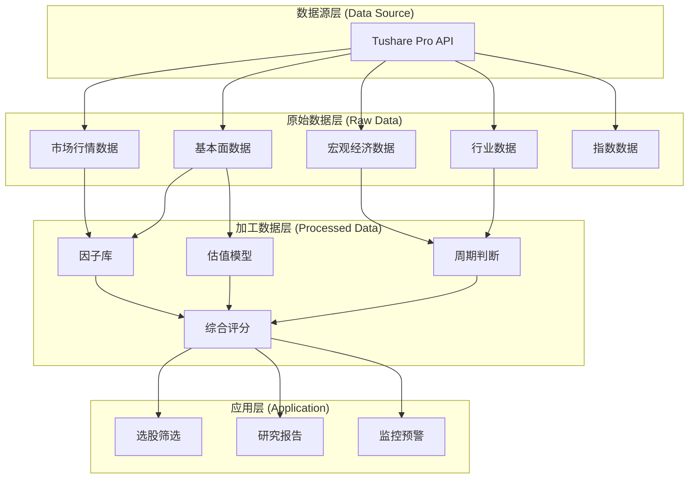
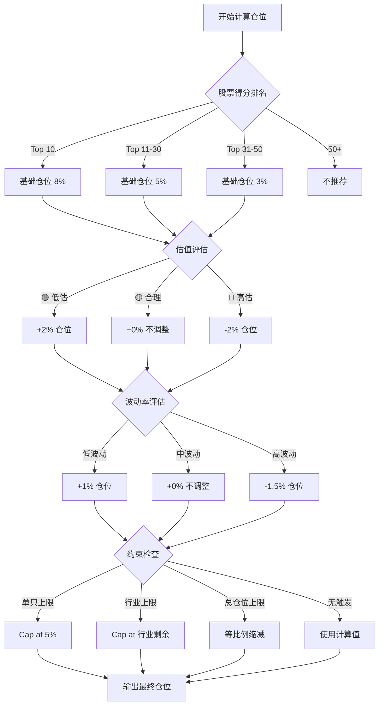

# 长线 A 股数据分析项目架构设计

> **项目名称**: Quant_A_Share_LongTerm  
> **定位**: 面向长线价值投资的 A 股数据分析与选股系统  
> **数据源**: Tushare Pro API  
> **创建日期**: 2025-12-27

---

## 1. 项目定位与目标

### 1.1 核心定位

本项目是一个**长线价值投资导向的 A 股数据分析系统**，与现有 `Quant_A_Share_V2.0`（偏短线量化交易）形成互补。

**定位差异对比**:

| 维度 | Quant_A_Share_V2.0 (短线) | Quant_A_Share_LongTerm (长线) |
|------|---------------------------|-------------------------------|
| 投资周期 | 4-5 个交易日 | 3 个月 ~ 1 年+ |
| 核心逻辑 | 技术面 + 机器学习 | 基本面 + 宏观周期 + 行业趋势 |
| 数据重点 | 行情/量价数据 | 财务/估值/宏观/行业数据 |
| 换手频率 | 高 (每周调仓) | 低 (季度/半年调仓) |
| 数据源 | Baostock / Akshare | **Tushare Pro** |

### 1.2 设计目标

1. **多维数据整合**: 整合基本面、宏观经济、行业产业链、市场情绪等多维数据
2. **价值投资导向**: 支持 DCF、PB-ROE、PEG 等经典估值模型
3. **周期研判**: 融入宏观经济周期、行业景气度分析
4. **长线选股**: 输出月度/季度调仓的投资组合建议
5. **可视化分析**: 提供丰富的数据可视化与研究报告

---

## 2. 数据架构设计

> [!IMPORTANT]
> 本项目使用 **Tushare Pro** 作为唯一数据源，需要注册并获取 API Token。
> 积分等级影响可调用的接口和频率限制，建议至少 200 积分。

### 2.1 数据分层总览



---

### 2.2 数据模块详细设计

#### 2.2.1 市场行情数据 (`market`)

**用途**: 获取股票的日/周/月K线、复权因子、涨跌停价格等

| 接口名称 | Tushare API | 说明 | 更新频率 |
|----------|-------------|------|----------|
| 日线行情 | `daily` | OHLCV + 涨跌/换手 | 每日 |
| 周线行情 | `weekly` | 周度K线 | 每周 |
| 月线行情 | `monthly` | 月度K线 | 每月 |
| 复权因子 | `adj_factor` | 前/后复权计算 | 每日 |
| 每日指标 | `daily_basic` | PE/PB/PS/总市值/流通市值 | 每日 |
| 涨跌停价格 | `stk_limit` | 涨停价/跌停价 | 每日 |
| 停牌信息 | `suspend_d` | 停牌日期及原因 | 实时 |

---

#### 2.2.2 基本面数据 (`fundamental`)

> [!NOTE]
> 基本面数据是长线投资的核心，本项目将深度整合财务报表、估值指标、业绩预告等。

**A. 财务报表类**

| 接口名称 | Tushare API | 说明 | 更新频率 |
|----------|-------------|------|----------|
| 利润表 | `income` | 营收/净利/毛利率等 | 季报 |
| 资产负债表 | `balancesheet` | 资产/负债/所有者权益 | 季报 |
| 现金流量表 | `cashflow` | 经营/投资/筹资现金流 | 季报 |
| 财务指标 | `fina_indicator` | EPS/ROE/ROA/毛利率等 | 季报 |
| 财务审计 | `fina_audit` | 审计意见 | 年报 |

**B. 业绩与预告类**

| 接口名称 | Tushare API | 说明 | 更新频率 |
|----------|-------------|------|----------|
| 业绩预告 | `forecast` | 预告类型/净利变动幅度 | 实时 |
| 业绩快报 | `express` | 快报速算指标 | 实时 |
| 分红送股 | `dividend` | 分红/送转/除权信息 | 实时 |

**C. 估值指标类** (来自 `daily_basic`)

| 字段 | 说明 |
|------|------|
| `pe` / `pe_ttm` | 市盈率 (静态/TTM) |
| `pb` | 市净率 |
| `ps` / `ps_ttm` | 市销率 |
| `dv_ratio` / `dv_ttm` | 股息率 |
| `total_mv` | 总市值 |
| `circ_mv` | 流通市值 |

---

#### 2.2.3 宏观经济数据 (`macro`)

> [!TIP]
> 宏观数据用于判断经济周期位置，辅助资产配置和行业轮动决策。

**A. 国民经济数据**

| 接口名称 | Tushare API | 说明 | 更新频率 |
|----------|-------------|------|----------|
| GDP | `cn_gdp` | 季度GDP及同比 | 季度 |
| CPI | `cn_cpi` | 居民消费价格指数 | 月度 |
| PPI | `cn_ppi` | 工业品出厂价格指数 | 月度 |
| PMI | `cn_pmi` | 制造业采购经理人指数 | 月度 |

**B. 货币金融数据**

| 接口名称 | Tushare API | 说明 | 更新频率 |
|----------|-------------|------|----------|
| 货币供应量 | `cn_m` | M0/M1/M2及同比 | 月度 |
| 存款利率 | `shibor` | 银行间拆借利率 | 每日 |
| 社会融资 | `sf` | 社融总量及结构 | 月度 |

**C. 利率与汇率**

| 接口名称 | Tushare API | 说明 | 更新频率 |
|----------|-------------|------|----------|
| 国债收益率 | `yc_cb` | 国债收益率曲线 | 每日 |
| LPR利率 | `lpr` | 贷款市场报价利率 | 月度 |
| 汇率 | `fx_daily` | 人民币汇率 | 每日 |

---

#### 2.2.4 行业数据 (`industry`)

**A. 行业分类**

| 接口名称 | Tushare API | 说明 |
|----------|-------------|------|
| 申万行业分类 | `index_classify` | 三级行业分类体系 |
| 申万行业成分 | `index_member` | 个股所属行业 |
| 概念板块 | `concept` | 热门概念分类 |
| 概念成分 | `concept_detail` | 概念板块成分股 |

**B. 行业指数行情**

| 接口名称 | Tushare API | 说明 |
|----------|-------------|------|
| 申万指数日线 | `sw_daily` | 行业指数日线行情 |
| 同花顺概念指数 | `ths_daily` | 概念指数行情 |

> [!NOTE]
> 行业景气度数据可通过行业内个股的财务数据聚合计算得到。

---

#### 2.2.5 指数与基准数据 (`index`)

| 接口名称 | Tushare API | 说明 |
|----------|-------------|------|
| 指数日线 | `index_daily` | 上证/沪深300/中证500等 |
| 指数成分 | `index_weight` | 指数成分股及权重 |
| 大类资产 | - | 国债/黄金/原油等 (扩展) |

---

### 2.3 数据存储规划

```
data/
├── raw/                          # 原始数据
│   ├── market/                   # 市场行情
│   │   ├── daily/                # 日线 (按年份分文件)
│   │   ├── daily_basic/          # 每日指标
│   │   └── adj_factor/           # 复权因子
│   ├── fundamental/              # 基本面数据
│   │   ├── income/               # 利润表
│   │   ├── balancesheet/         # 资产负债表
│   │   ├── cashflow/             # 现金流量表
│   │   ├── fina_indicator/       # 财务指标
│   │   ├── forecast/             # 业绩预告
│   │   └── dividend/             # 分红送股
│   ├── macro/                    # 宏观经济
│   │   ├── gdp.parquet
│   │   ├── cpi.parquet
│   │   ├── ppi.parquet
│   │   ├── pmi.parquet
│   │   ├── monetary.parquet      # M0/M1/M2
│   │   ├── shibor.parquet
│   │   └── treasury_yield.parquet
│   ├── industry/                 # 行业数据
│   │   ├── sw_classify.parquet   # 申万分类
│   │   ├── sw_daily/             # 行业指数行情
│   │   └── concepts.parquet      # 概念板块
│   └── index/                    # 指数数据
│       ├── index_daily/
│       └── index_weight/
│
├── processed/                    # 加工数据
│   ├── factors/                  # 因子库
│   │   ├── valuation_factors.parquet     # 估值因子
│   │   ├── quality_factors.parquet       # 质量因子
│   │   ├── growth_factors.parquet        # 成长因子
│   │   ├── momentum_factors.parquet      # 动量因子
│   │   └── all_factors.parquet           # 合并因子表
│   ├── scores/                   # 综合评分
│   │   └── stock_scores.parquet
│   └── cycles/                   # 周期判断
│       ├── macro_cycle.parquet
│       └── industry_cycle.parquet
│
└── meta/                         # 元数据
    ├── stock_basic.parquet       # 股票基础信息
    ├── trade_cal.parquet         # 交易日历
    └── industry_mapping.parquet  # 行业映射
```

---

## 3. 系统模块设计

### 3.1 目录结构

```
Quant_A_Share_LongTerm/
├── config/
│   └── main.yaml                 # 主配置文件
│
├── data/                         # 数据目录 (见 2.3)
│
├── src/
│   ├── data_source/              # 数据获取层
│   │   ├── base.py               # 抽象基类
│   │   ├── tushare_source.py     # Tushare API 封装
│   │   └── datahub.py            # 统一数据入口
│   │
│   ├── downloader/               # 数据下载器
│   │   ├── market_downloader.py  # 市场行情下载
│   │   ├── fundamental_downloader.py  # 基本面数据下载
│   │   ├── macro_downloader.py   # 宏观数据下载
│   │   └── industry_downloader.py     # 行业数据下载
│   │
│   ├── preprocessing/            # 数据预处理
│   │   ├── cleaner.py            # 数据清洗
│   │   ├── adjuster.py           # 复权处理
│   │   └── validator.py          # 数据校验
│   │
│   ├── pipeline_analysis/        # [新增] 数据管道分析
│   │   ├── base_analyzer.py      # 分析器基类
│   │   ├── raw_data_analyzer.py  # 原始数据分析
│   │   ├── cleaned_data_analyzer.py  # 清洗后数据分析
│   │   ├── factor_analyzer.py    # 因子数据分析
│   │   └── report_generator.py   # 综合报告生成
│   │
│   ├── factors/                  # 因子计算
│   │   ├── valuation.py          # 估值因子 (PE/PB/PS/PEG)
│   │   ├── quality.py            # 质量因子 (ROE/ROA/毛利率)
│   │   ├── growth.py             # 成长因子 (营收增速/利润增速)
│   │   ├── momentum.py           # 动量因子 (价格/业绩动量)
│   │   ├── dividend.py           # 股息因子
│   │   └── pipeline.py           # 因子计算流水线
│   │
│   ├── factor_analysis/          # [新增] 因子表现分析
│   │   ├── ic_analysis.py        # IC/IR 分析
│   │   ├── layer_backtest.py     # 分层回测
│   │   ├── factor_decay.py       # 因子衰减分析
│   │   ├── turnover_analysis.py  # 因子换手分析
│   │   ├── correlation.py        # 因子相关性分析
│   │   ├── factor_combination.py # 因子合成优化
│   │   └── factor_report.py      # 综合因子报告
│   │
│   ├── valuation/                # 估值模型
│   │   ├── dcf.py                # 现金流折现模型
│   │   ├── pb_roe.py             # PB-ROE 模型
│   │   ├── peg.py                # PEG 估值模型
│   │   └── relative.py           # 相对估值 (历史分位)
│   │
│   ├── cycle/                    # 周期分析
│   │   ├── macro_cycle.py        # 宏观经济周期
│   │   ├── industry_cycle.py     # 行业景气周期
│   │   └── market_regime.py      # 市场状态判断
│   │
│   ├── position/                 # [新增] 仓位管理
│   │   ├── base.py               # 仓位管理基类
│   │   ├── fixed_position.py     # 固定仓位 (等权/指定权重)
│   │   ├── risk_parity.py        # 风险平价
│   │   ├── kelly_position.py     # 凯利公式
│   │   ├── volatility_target.py  # 目标波动率
│   │   ├── drawdown_control.py   # 回撤控制
│   │   └── position_manager.py   # 仓位管理器
│   │
│   ├── strategy/                 # 策略层
│   │   ├── screener.py           # 选股筛选器
│   │   ├── scorer.py             # 综合评分
│   │   ├── portfolio.py          # 组合构建
│   │   └── rebalance.py          # 调仓逻辑
│   │
│   ├── backtest_bt/              # [新增] Backtrader 回测框架
│   │   ├── data_feeds/           # 数据源适配
│   │   │   ├── tushare_feed.py   # Tushare 数据转 Backtrader 格式
│   │   │   └── parquet_feed.py   # Parquet 文件数据源
│   │   ├── strategies/           # 策略定义
│   │   │   ├── base_strategy.py  # 策略基类
│   │   │   ├── factor_rotation.py    # 因子轮动策略
│   │   │   ├── value_momentum.py     # 价值+动量策略
│   │   │   └── multi_factor.py       # 多因子选股策略
│   │   ├── sizers/               # 仓位管理
│   │   │   ├── equal_weight.py
│   │   │   ├── risk_parity_sizer.py
│   │   │   └── kelly_sizer.py
│   │   ├── analyzers/            # 分析器
│   │   │   ├── returns_analyzer.py
│   │   │   ├── drawdown_analyzer.py
│   │   │   ├── trade_analyzer.py
│   │   │   └── factor_expose.py
│   │   ├── engine.py             # 回测引擎封装
│   │   └── report.py             # 回测报告生成
│   │
│   ├── advisor/                  # [新增] 可视化投资建议
│   │   ├── dashboard/            # 仪表盘
│   │   │   ├── market_overview.py
│   │   │   ├── macro_dashboard.py
│   │   │   └── sector_heatmap.py
│   │   ├── stock_cards/          # 个股卡片
│   │   │   ├── stock_card.py
│   │   │   ├── valuation_chart.py
│   │   │   └── financial_trend.py
│   │   ├── portfolio_view/       # 组合视图
│   │   │   ├── holdings.py
│   │   │   ├── allocation.py
│   │   │   └── rebalance_plan.py
│   │   ├── report_templates/     # 报告模板
│   │   │   ├── weekly_report.html
│   │   │   ├── monthly_report.html
│   │   │   └── stock_research.html
│   │   ├── exporters/            # 导出器
│   │   │   ├── html_exporter.py
│   │   │   ├── pdf_exporter.py
│   │   │   └── email_sender.py
│   │   └── advisor.py            # 投资顾问主接口
│   │
│   ├── explainer/                # [新增] 投资决策可解释性
│   │   ├── valuation_explainer.py    # 估值可解释性 ("是否便宜?")
│   │   ├── thesis_generator.py       # 投资论点生成 ("为什么买?")  
│   │   ├── risk_warner.py            # 风险提示生成
│   │   ├── comparator.py             # 同业对比分析
│   │   └── decision_report.py        # 综合决策报告
│   │
│   ├── analysis/                 # 分析模块
│   │   ├── stock_report.py       # 个股研究报告
│   │   ├── sector_analysis.py    # 行业分析
│   │   └── macro_dashboard.py    # 宏观仪表盘
│   │
│   └── utils/                    # 工具模块
│       ├── logger.py
│       ├── config.py
│       ├── calendar.py
│       └── io.py
│
├── scripts/                      # 脚本入口
│   ├── data/
│   │   ├── update_market.py      # 更新行情数据
│   │   ├── update_fundamental.py # 更新基本面数据
│   │   ├── update_macro.py       # 更新宏观数据
│   │   └── update_all.py         # 全量更新
│   │
│   ├── factor/
│   │   ├── build_factors.py      # 构建因子库
│   │   └── analyze_factors.py    # [新增] 因子分析
│   │
│   ├── strategy/
│   │   ├── run_screening.py      # 运行选股
│   │   └── run_backtest.py       # 运行回测
│   │
│   └── report/
│       ├── generate_stock_report.py  # 生成个股报告
│       ├── generate_monthly_report.py # 月度报告
│       └── generate_dashboard.py     # [新增] 生成仪表盘
│
├── notebooks/                    # Jupyter 研究笔记
├── reports/                      # 输出报告
├── figures/                      # 图表输出
├── logs/                         # 日志
│
├── requirements.txt
├── architecture.md               # 本文档
└── README.md
```

---

### 3.2 核心模块接口设计

#### 3.2.1 数据源接口 (`src/data_source/tushare_source.py`)

```python
class TushareSource:
    """Tushare Pro API 封装"""
    
    def __init__(self, token: str):
        self.pro = ts.pro_api(token)
    
    # === 市场数据 ===
    def get_daily(self, ts_code: str, start_date: str, end_date: str) -> pd.DataFrame:
        """获取日线行情"""
        pass
    
    def get_daily_basic(self, trade_date: str) -> pd.DataFrame:
        """获取每日指标 (PE/PB/市值等)"""
        pass
    
    def get_adj_factor(self, ts_code: str) -> pd.DataFrame:
        """获取复权因子"""
        pass
    
    # === 基本面数据 ===
    def get_income(self, ts_code: str, period: str = None) -> pd.DataFrame:
        """获取利润表"""
        pass
    
    def get_balancesheet(self, ts_code: str, period: str = None) -> pd.DataFrame:
        """获取资产负债表"""
        pass
    
    def get_cashflow(self, ts_code: str, period: str = None) -> pd.DataFrame:
        """获取现金流量表"""
        pass
    
    def get_fina_indicator(self, ts_code: str) -> pd.DataFrame:
        """获取财务指标"""
        pass
    
    def get_forecast(self, ann_date: str = None) -> pd.DataFrame:
        """获取业绩预告"""
        pass
    
    # === 宏观数据 ===
    def get_cn_gdp(self) -> pd.DataFrame:
        """获取GDP数据"""
        pass
    
    def get_cn_cpi(self) -> pd.DataFrame:
        """获取CPI数据"""
        pass
    
    def get_cn_pmi(self) -> pd.DataFrame:
        """获取PMI数据"""
        pass
    
    def get_shibor(self, start_date: str, end_date: str) -> pd.DataFrame:
        """获取SHIBOR利率"""
        pass
    
    # === 行业数据 ===
    def get_sw_industry(self, level: str = 'L1') -> pd.DataFrame:
        """获取申万行业分类"""
        pass
    
    def get_sw_daily(self, index_code: str, start_date: str, end_date: str) -> pd.DataFrame:
        """获取行业指数日线"""
        pass
```

---

#### 3.2.2 因子计算接口

**估值因子** (`src/factors/valuation.py`):
```python
def calc_pe_percentile(df: pd.DataFrame, window: int = 252 * 5) -> pd.Series:
    """计算PE历史分位数 (5年)"""
    pass

def calc_pb_roe_score(df: pd.DataFrame) -> pd.Series:
    """PB-ROE 打分: 低PB + 高ROE = 高分"""
    pass

def calc_peg(df: pd.DataFrame) -> pd.Series:
    """PEG = PE / 预期盈利增速"""
    pass
```

**质量因子** (`src/factors/quality.py`):
```python
def calc_roe_stability(df: pd.DataFrame, years: int = 5) -> pd.Series:
    """ROE稳定性 (过去5年ROE标准差)"""
    pass

def calc_gross_margin_trend(df: pd.DataFrame) -> pd.Series:
    """毛利率变化趋势"""
    pass

def calc_debt_ratio_score(df: pd.DataFrame) -> pd.Series:
    """负债率评分 (越低越好)"""
    pass
```

---

#### 3.2.3 周期判断接口

```python
class MacroCycleAnalyzer:
    """宏观经济周期分析"""
    
    def get_cycle_phase(self) -> str:
        """
        判断当前宏观周期位置:
        - 'recovery': 复苏期 (GDP↑, CPI↓)
        - 'expansion': 扩张期 (GDP↑, CPI↑)
        - 'stagflation': 滞胀期 (GDP↓, CPI↑)
        - 'recession': 衰退期 (GDP↓, CPI↓)
        """
        pass
    
    def get_sector_allocation(self) -> Dict[str, float]:
        """基于周期的行业配置建议"""
        pass
```

---

### 3.3 数据契约

#### 3.3.1 因子表标准格式

```python
# all_factors.parquet 标准格式
columns = [
    'date',           # 交易日期 (index)
    'ts_code',        # 股票代码 (index)
    
    # === 估值因子 ===
    'factor_pe_ttm',
    'factor_pb',
    'factor_ps_ttm',
    'factor_pe_percentile',   # PE 5年分位
    'factor_pb_percentile',   # PB 5年分位
    'factor_peg',
    
    # === 质量因子 ===
    'factor_roe',
    'factor_roa',
    'factor_gross_margin',
    'factor_debt_ratio',
    'factor_roe_stability',   # ROE 稳定性
    
    # === 成长因子 ===
    'factor_revenue_yoy',     # 营收同比
    'factor_profit_yoy',      # 利润同比
    'factor_eps_growth',      # EPS 增速
    
    # === 动量因子 ===
    'factor_ret_1m',          # 近1月收益
    'factor_ret_3m',          # 近3月收益
    'factor_ret_6m',          # 近6月收益
    'factor_ret_12m',         # 近12月收益
    
    # === 股息因子 ===
    'factor_dv_ttm',          # 股息率TTM
    'factor_dv_3y_avg',       # 3年平均股息率
]
```

#### 3.3.2 选股结果标准格式

```python
# stock_scores.parquet 标准格式
columns = [
    'date',
    'ts_code',
    'name',
    'industry',          # 申万一级行业
    
    # 分项得分 (0-100)
    'score_valuation',   # 估值得分
    'score_quality',     # 质量得分
    'score_growth',      # 成长得分
    'score_momentum',    # 动量得分
    'score_dividend',    # 股息得分
    
    # 加权总分
    'score_total',
    
    # 排名
    'rank',
]
```

---

## 4. 配置设计

### 4.1 主配置文件 (`config/main.yaml`)

```yaml
# config/main.yaml

# ==============================================================================
# 1. Tushare API 配置
# ==============================================================================
tushare:
  token: "YOUR_TUSHARE_TOKEN"     # 请替换为你的 token
  timeout: 30                      # 请求超时 (秒)
  retry: 3                         # 重试次数
  rate_limit: 200                  # 每分钟最大请求数

# ==============================================================================
# 2. 路径配置
# ==============================================================================
paths:
  project_root: "."
  data_raw: "data/raw"
  data_processed: "data/processed"
  data_meta: "data/meta"
  figures: "figures"
  reports: "reports"
  logs: "logs"

# ==============================================================================
# 3. 数据更新配置
# ==============================================================================
data:
  start_date: "2010-01-01"
  end_date: "auto"                 # auto = 使用当前日期
  
  # 股票池
  stock_pool:
    exclude_st: true
    exclude_kcb: true              # 排除科创板
    exclude_bj: true               # 排除北交所
    min_market_cap: 3000000000     # 最小市值 30亿
    min_list_days: 365             # 上市至少1年

# ==============================================================================
# 4. 因子配置
# ==============================================================================
factors:
  valuation:
    pe_percentile_window: 1260     # PE分位计算窗口 (5年)
    pb_percentile_window: 1260
    
  quality:
    roe_stability_years: 5
    
  growth:
    eps_growth_years: 3
    
  momentum:
    windows: [21, 63, 126, 252]    # 1m/3m/6m/12m

# ==============================================================================
# 5. 选股策略配置
# ==============================================================================
strategy:
  # 因子权重 (合计=1.0)
  weights:
    valuation: 0.25
    quality: 0.30
    growth: 0.20
    momentum: 0.15
    dividend: 0.10
  
  # 选股数量
  top_k: 30
  
  # 调仓频率
  rebalance_freq: "monthly"       # monthly / quarterly
  
  # 行业约束
  max_industry_weight: 0.20       # 单一行业最大权重

# ==============================================================================
# 6. 宏观周期配置
# ==============================================================================
macro_cycle:
  # 周期判断阈值
  gdp_growth_threshold: 6.0       # GDP增速阈值
  cpi_inflation_threshold: 3.0    # CPI通胀阈值
  
  # 行业轮动配置 (不同周期推荐的行业)
  sector_rotation:
    recovery: ["消费", "金融", "房地产"]
    expansion: ["科技", "周期", "工业"]
    stagflation: ["能源", "原材料", "必选消费"]
    recession: ["公用事业", "医药", "债券"]
```

---

## 5. 增强功能模块 (相对于短线项目的新增)

> [!IMPORTANT]
> 以下模块是本长线项目相对于 `Quant_A_Share_V2.0` 的核心差异化功能。

### 5.1 数据加工流程分析 (`src/pipeline_analysis/`)

**目标**: 在数据加工的每个阶段输出详细的数据质量报告，实现数据流程的可追溯与可视化。

#### 5.1.1 模块设计

```
src/pipeline_analysis/
├── base_analyzer.py          # 分析器基类
├── raw_data_analyzer.py      # 原始数据分析
├── cleaned_data_analyzer.py  # 清洗后数据分析
├── factor_analyzer.py        # 因子数据分析
└── report_generator.py       # 综合报告生成
```

#### 5.1.2 各阶段分析内容

**A. 原始数据分析 (`raw_data_analyzer.py`)**

| 分析项 | 说明 | 输出 |
|--------|------|------|
| 完整性检查 | 缺失值统计、停牌天数占比 | 热力图 + 表格 |
| 时间连续性 | 检测数据断档、节假日对齐 | 异常日期列表 |
| 数值合理性 | 价格/成交量异常检测 | 异常记录明细 |
| 复权正确性 | 前后复权对比验证 | 对比图表 |

**B. 财务数据分析 (`fundamental_analyzer.py`)**

| 分析项 | 说明 |
|--------|------|
| 报告期覆盖 | 各公司财报披露完整度 |
| 异常指标 | ROE>100%、负毛利等异常值 |
| 同比环比 | 财务指标的变化率分布 |
| 审计意见 | 非标准审计意见统计 |

**C. 因子数据分析 (`factor_analyzer.py`)**

| 分析项 | 说明 |
|--------|------|
| 分布统计 | 每个因子的均值/中位数/偏度/峰度 |
| 极值检测 | 因子极端值占比 |
| 因子相关性 | 因子间相关矩阵热力图 |
| 覆盖度 | 各因子的有效样本覆盖率 |

#### 5.1.3 接口设计

```python
class PipelineAnalyzer:
    """数据管道分析器"""
    
    def analyze_raw_data(self, data: pd.DataFrame, data_type: str) -> AnalysisReport:
        """
        分析原始数据质量
        
        Args:
            data: 原始数据
            data_type: "market" / "fundamental" / "macro"
        
        Returns:
            AnalysisReport: 包含统计信息、异常列表、可视化图表路径
        """
        pass
    
    def analyze_factors(self, factors_df: pd.DataFrame) -> FactorAnalysisReport:
        """
        分析因子数据质量与特征
        
        Returns:
            FactorAnalysisReport: 因子分布、相关性、覆盖度报告
        """
        pass
    
    def generate_pipeline_report(self, output_dir: str) -> str:
        """
        生成完整的管道分析 HTML 报告
        """
        pass
```

---

### 5.2 仓位管理模块 (`src/position/`)

**目标**: 实现科学的仓位控制，根据市场状态、个股风险、组合约束动态调整仓位。

#### 5.2.1 模块设计

```
src/position/
├── base.py                   # 仓位管理基类
├── fixed_position.py         # 固定仓位 (等权/指定权重)
├── risk_parity.py           # 风险平价
├── kelly_position.py        # 凯利公式
├── volatility_target.py     # 目标波动率
├── drawdown_control.py      # 回撤控制
└── position_manager.py      # 仓位管理器 (组合多种策略)
```

#### 5.2.2 仓位策略详解

**A. 固定仓位策略**

```python
class FixedPositionSizer:
    """固定仓位分配"""
    
    def equal_weight(self, n_stocks: int) -> Dict[str, float]:
        """等权分配: 每只股票 1/N"""
        pass
    
    def market_cap_weight(self, stocks: List[str]) -> Dict[str, float]:
        """市值加权"""
        pass
    
    def score_weight(self, scores: pd.Series, power: float = 1.0) -> Dict[str, float]:
        """得分加权: 得分越高权重越大"""
        pass
```

**B. 风险平价策略**

```python
class RiskParitySizer:
    """风险平价: 使各标的对组合风险的贡献相等"""
    
    def calculate_weights(
        self, 
        returns: pd.DataFrame, 
        lookback: int = 60
    ) -> Dict[str, float]:
        """
        基于历史波动率计算风险平价权重
        权重 ∝ 1 / σ_i (波动率的倒数)
        """
        pass
```

**C. 目标波动率策略**

```python
class VolatilityTargetSizer:
    """目标波动率: 根据市场波动动态调整整体仓位"""
    
    def __init__(self, target_vol: float = 0.15):
        """
        Args:
            target_vol: 目标年化波动率 (如 15%)
        """
        self.target_vol = target_vol
    
    def calculate_position_ratio(
        self, 
        realized_vol: float
    ) -> float:
        """
        position_ratio = target_vol / realized_vol
        
        - 市场波动高 → 降低仓位
        - 市场波动低 → 可以加仓
        """
        return min(self.target_vol / realized_vol, 1.5)  # 上限 150%
```

**D. 回撤控制策略**

```python
class DrawdownController:
    """最大回撤控制: 触及止损线时减仓/清仓"""
    
    def __init__(
        self, 
        max_drawdown: float = 0.10,     # 单标的最大回撤 10%
        portfolio_max_dd: float = 0.15  # 组合最大回撤 15%
    ):
        pass
    
    def check_and_adjust(
        self, 
        current_positions: Dict[str, float],
        current_pnl: Dict[str, float]
    ) -> Dict[str, float]:
        """
        检查各标的及组合回撤，触发止损则调整仓位
        """
        pass
```

#### 5.2.3 仓位管理器接口

```python
class PositionManager:
    """综合仓位管理器"""
    
    def __init__(self, config: dict):
        """
        config 示例:
        {
            "base_sizer": "risk_parity",      # 基础分配方法
            "vol_target": 0.15,               # 目标波动率
            "max_single_weight": 0.10,        # 单只最大仓位 10%
            "max_industry_weight": 0.25,      # 单行业最大 25%
            "max_drawdown": 0.15,             # 最大回撤 15%
        }
        """
        pass
    
    def calculate_target_positions(
        self,
        selected_stocks: List[str],
        scores: pd.Series,
        market_data: pd.DataFrame
    ) -> pd.DataFrame:
        """
        计算目标仓位
        
        Returns:
            DataFrame with columns: [ts_code, target_weight, target_shares]
        """
        pass
    
    def generate_orders(
        self,
        current_positions: Dict[str, float],
        target_positions: Dict[str, float]
    ) -> List[Order]:
        """
        生成调仓订单 (买入/卖出指令)
        """
        pass
```

---

### 5.3 Backtrader 回测框架 (`src/backtest_bt/`)

**目标**: 引入成熟的 Backtrader 框架，提供专业级的事件驱动回测能力。

> [!NOTE]
> Backtrader 是 Python 中最成熟的回测框架之一，支持事件驱动、多标的、多时间框架回测。

#### 5.3.1 模块设计

```
src/backtest_bt/
├── data_feeds/               # 数据源适配
│   ├── tushare_feed.py       # Tushare 数据转 Backtrader 格式
│   └── parquet_feed.py       # Parquet 文件数据源
│
├── strategies/               # 策略定义
│   ├── base_strategy.py      # 策略基类 (封装公共逻辑)
│   ├── factor_rotation.py    # 因子轮动策略
│   ├── value_momentum.py     # 价值+动量组合策略
│   └── multi_factor.py       # 多因子选股策略
│
├── sizers/                   # 仓位管理 (与 5.2 模块集成)
│   ├── equal_weight.py
│   ├── risk_parity_sizer.py
│   └── kelly_sizer.py
│
├── analyzers/                # 分析器
│   ├── returns_analyzer.py   # 收益分析
│   ├── drawdown_analyzer.py  # 回撤分析
│   ├── trade_analyzer.py     # 交易分析
│   └── factor_expose.py      # 因子暴露分析
│
├── observers/                # 观察器 (实时监控)
│   └── position_observer.py
│
├── engine.py                 # 回测引擎封装
└── report.py                 # 回测报告生成
```

#### 5.3.2 核心接口设计

**A. 数据源适配器**

```python
class TushareDataFeed(bt.feeds.PandasData):
    """将 Tushare 数据转换为 Backtrader 格式"""
    
    params = (
        ('datetime', 'date'),
        ('open', 'open'),
        ('high', 'high'),
        ('low', 'low'),
        ('close', 'close'),
        ('volume', 'vol'),
        ('openinterest', None),
        
        # 扩展字段
        ('pe', 'pe_ttm'),
        ('pb', 'pb'),
        ('score', 'score'),  # 因子得分
    )
```

**B. 多因子策略示例**

```python
class MultiFactorStrategy(bt.Strategy):
    """多因子选股策略"""
    
    params = (
        ('rebalance_freq', 'monthly'),   # 调仓频率
        ('top_k', 30),                   # 持股数量
        ('factor_weights', None),        # 因子权重
    )
    
    def __init__(self):
        self.rebalance_dates = []
        self.factor_scorer = FactorScorer(self.params.factor_weights)
    
    def next(self):
        # 检查是否为调仓日
        if not self._is_rebalance_day():
            return
        
        # 计算当日因子得分
        scores = self.factor_scorer.calculate(self.datas)
        
        # 选出 Top K
        selected = scores.nlargest(self.params.top_k)
        
        # 平滑调仓
        self._rebalance_portfolio(selected)
    
    def _rebalance_portfolio(self, target_stocks):
        """执行调仓逻辑"""
        pass
```

**C. 回测引擎封装**

```python
class BacktestEngine:
    """Backtrader 回测引擎封装"""
    
    def __init__(self, config: dict):
        """
        config 示例:
        {
            "initial_cash": 1000000,
            "commission": 0.001,         # 佣金 0.1%
            "slippage": 0.001,           # 滑点 0.1%
            "stamp_tax": 0.001,          # 印花税 0.1% (卖出)
        }
        """
        self.cerebro = bt.Cerebro()
        self._setup_broker(config)
    
    def add_data(self, data_source: str, symbols: List[str]):
        """添加多标的数据"""
        pass
    
    def set_strategy(self, strategy_class, **kwargs):
        """设置回测策略"""
        self.cerebro.addstrategy(strategy_class, **kwargs)
    
    def add_analyzer(self, analyzer_class):
        """添加分析器"""
        self.cerebro.addanalyzer(analyzer_class)
    
    def run(self) -> BacktestResult:
        """运行回测"""
        results = self.cerebro.run()
        return self._parse_results(results)
    
    def generate_report(self, output_path: str) -> str:
        """生成 HTML 回测报告"""
        pass
```

#### 5.3.3 回测报告内容

| 报告模块 | 内容 |
|----------|------|
| **绩效概览** | 年化收益、夏普比率、最大回撤、胜率 |
| **收益归因** | 因子贡献度、行业贡献度、时间序列分解 |
| **风险分析** | 波动率、VaR、回撤周期、恢复时间 |
| **交易统计** | 交易次数、换手率、平均持仓周期 |
| **月度热力图** | 各月收益率热力图 |
| **净值曲线** | 策略 vs 基准 (沪深300) 对比图 |

---

### 5.4 因子表现分析 (`src/factor_analysis/`)

**目标**: 系统性地分析各长线因子的有效性、稳定性与相互关系。

#### 5.4.1 模块设计

```
src/factor_analysis/
├── ic_analysis.py           # IC/IR 分析
├── layer_backtest.py        # 分层回测
├── factor_decay.py          # 因子衰减分析
├── turnover_analysis.py     # 因子换手分析
├── correlation.py           # 因子相关性分析
├── factor_combination.py    # 因子合成优化
└── factor_report.py         # 综合因子报告
```

#### 5.4.2 核心分析方法

**A. IC/IR 分析**

```python
class ICAnalyzer:
    """信息系数分析"""
    
    def calculate_ic(
        self, 
        factor: pd.Series, 
        returns: pd.Series,
        method: str = 'spearman'   # 或 'pearson'
    ) -> float:
        """
        计算单期 IC = corr(factor_t, return_{t+1})
        """
        pass
    
    def calculate_ic_series(
        self,
        factor_df: pd.DataFrame,
        return_df: pd.DataFrame,
        horizon: int = 20          # 收益计算周期 (20交易日≈1月)
    ) -> pd.DataFrame:
        """
        计算 IC 时间序列
        
        Returns:
            DataFrame with columns: [date, IC, cumulative_IC]
        """
        pass
    
    def calculate_ir(self, ic_series: pd.Series) -> float:
        """
        IR = mean(IC) / std(IC)
        
        IR > 0.5: 优秀因子
        0.3 < IR < 0.5: 良好因子
        IR < 0.3: 一般因子
        """
        return ic_series.mean() / ic_series.std()
```

**B. 分层回测**

```python
class LayerBacktester:
    """因子分层回测"""
    
    def run_layer_test(
        self,
        factor: pd.Series,
        returns: pd.DataFrame,
        n_layers: int = 5,         # 分5层
        holding_period: int = 20   # 持有20天
    ) -> LayerTestResult:
        """
        1. 每期按因子值分成 N 层
        2. 计算每层的未来收益
        3. 检验单调性 (第1层 > 第2层 > ... > 第N层?)
        
        Returns:
            LayerTestResult: 包含各层收益曲线、年化收益、单调性指标
        """
        pass
    
    def plot_layer_returns(self, result: LayerTestResult, save_path: str):
        """
        绘制分层收益曲线图
        - X轴: 时间
        - Y轴: 累计收益
        - 5条曲线对应5个分层
        """
        pass
```

**C. 因子衰减分析**

```python
class FactorDecayAnalyzer:
    """因子衰减分析: 因子的预测能力随时间如何变化"""
    
    def analyze_decay(
        self,
        factor: pd.Series,
        returns: pd.DataFrame,
        horizons: List[int] = [5, 10, 20, 40, 60]  # 天数
    ) -> pd.DataFrame:
        """
        计算不同预测周期的 IC
        
        Returns:
            DataFrame: columns = horizons, 
                      values = IC for each horizon
        """
        pass
    
    def get_optimal_horizon(self) -> int:
        """返回 IC 最高的预测周期"""
        pass
```

**D. 因子合成优化**

```python
class FactorCombiner:
    """因子合成与权重优化"""
    
    def equal_weight_combine(
        self, 
        factors: Dict[str, pd.Series]
    ) -> pd.Series:
        """等权合成"""
        pass
    
    def ic_weight_combine(
        self,
        factors: Dict[str, pd.Series],
        returns: pd.Series
    ) -> pd.Series:
        """
        IC 加权合成: 
        高 IC 的因子权重更大
        """
        pass
    
    def optimize_weights(
        self,
        factors: Dict[str, pd.Series],
        returns: pd.Series,
        method: str = 'max_ir'  # 最大化 IR
    ) -> Dict[str, float]:
        """
        数值优化因子权重
        
        方法:
        - 'max_ir': 最大化合成因子的 IR
        - 'max_return': 最大化回测收益
        - 'min_corr': 最小化因子相关性 (分散化)
        """
        pass
```

#### 5.4.3 因子分析报告

| 报告内容 | 说明 |
|----------|------|
| **因子概览表** | 各因子 IC均值、IC_IR、年化收益、最大回撤 |
| **IC 时序图** | 各因子 IC 的时间序列走势 |
| **分层收益图** | 5分层的累计收益对比 |
| **因子相关矩阵** | 热力图展示因子间相关性 |
| **衰减曲线图** | IC 随预测周期的变化 |
| **最优权重建议** | 基于优化的因子合成权重 |

---

### 5.5 可视化投资建议系统 (`src/advisor/`)

**目标**: 生成专业、美观、可操作的投资建议报告。

#### 5.5.1 模块设计

```
src/advisor/
├── dashboard/                # 仪表盘生成
│   ├── market_overview.py    # 市场概览
│   ├── macro_dashboard.py    # 宏观经济仪表盘
│   └── sector_heatmap.py     # 行业热力图
│
├── stock_cards/              # 个股卡片
│   ├── stock_card.py         # 个股信息卡
│   ├── valuation_chart.py    # 估值图表
│   └── financial_trend.py    # 财务趋势图
│
├── portfolio_view/           # 组合视图
│   ├── holdings.py           # 持仓概览
│   ├── allocation.py         # 配置结构
│   └── rebalance_plan.py     # 调仓计划
│
├── report_templates/         # 报告模板
│   ├── weekly_report.html    # 周报模板
│   ├── monthly_report.html   # 月报模板
│   └── stock_research.html   # 个股研报模板
│
├── exporters/                # 导出器
│   ├── html_exporter.py
│   ├── pdf_exporter.py
│   └── email_sender.py       # 邮件发送
│
└── advisor.py                # 投资顾问主接口
```

#### 5.5.2 报告类型与内容

**A. 月度投资报告**

```markdown
# 2025年1月 长线投资月报

## 1. 宏观环境概览
- 当前周期位置: 📈 复苏期
- GDP 增速: 5.2% (环比 +0.3%)
- CPI: 2.1%
- PMI: 50.8

## 2. 市场估值状态
[沪深300 PE 分位图: 当前 48%, 处于历史中位]

## 3. 本月推荐组合 (Top 10)

| 排名 | 股票 | 行业 | 估值 | 质量 | 成长 | 综合 |
|------|------|------|------|------|------|------|
| 1 | 招商银行 | 银行 | 85 | 92 | 70 | 88.5 |
| 2 | 贵州茅台 | 食品饮料| 72 | 95 | 68 | 85.2 |
| ... | ... | ... | ... | ... | ... | ... |

## 4. 调仓建议
- 新增: XX, XX
- 减持: XX
- 维持: XX, XX

## 5. 行业配置
[饼图: 金融 25%, 消费 20%, 医药 15%, ...]

## 6. 风险提示
- 关注: ...
```

**B. 个股研究卡片**

```python
class StockCard:
    """个股信息卡片生成器"""
    
    def generate(self, ts_code: str) -> str:
        """
        生成包含以下内容的 HTML 卡片:
        
        1. 基本信息区
           - 股票代码、名称、行业
           - 市值、PE、PB、股息率
        
        2. 估值区
           - PE/PB 历史分位 (温度计图)
           - 与行业对比
        
        3. 财务趋势区
           - 5年营收/净利走势
           - ROE 变化
        
        4. 因子评分区
           - 雷达图: 估值/质量/成长/动量/股息
        
        5. 分析师评级
           - (如有数据)
        
        6. 风险提示
           - 负面因素提示
        """
        pass
```

**C. 仪表盘组件**

```python
class MacroDashboard:
    """宏观经济仪表盘"""
    
    def generate(self) -> str:
        """
        生成包含以下组件的 HTML 页面:
        
        1. 经济周期罗盘
           - 当前位置标注 (复苏/扩张/滞胀/衰退)
        
        2. 核心指标卡片
           - GDP、CPI、PMI、M2 (带同环比箭头)
        
        3. 利率曲线
           - 国债收益率曲线 (1Y/3Y/5Y/10Y)
           - 期限利差走势
        
        4. 流动性指标
           - 社融、M1-M2 剪刀差
        
        5. 行业轮动建议
           - 基于周期的推荐行业
        """
        pass
```

#### 5.5.3 交互式功能

```python
class InvestmentAdvisor:
    """投资顾问主接口"""
    
    def generate_monthly_report(self, month: str) -> str:
        """生成月度报告 (HTML)"""
        pass
    
    def generate_stock_card(self, ts_code: str) -> str:
        """生成个股研报"""
        pass
    
    def generate_rebalance_plan(
        self,
        current_holdings: pd.DataFrame,
        target_portfolio: pd.DataFrame
    ) -> RebalancePlan:
        """
        生成调仓计划
        
        Returns:
            RebalancePlan:
                - 买入列表 (标的、数量、理由)
                - 卖出列表
                - 预估交易成本
                - 调仓前后对比
        """
        pass
    
    def export_to_pdf(self, report_html: str, output_path: str):
        """导出为 PDF"""
        pass
    
    def send_email_report(
        self, 
        report_html: str, 
        recipients: List[str]
    ):
        """发送邮件报告"""
        pass
```

---

### 5.6 投资决策可解释性模块 (`src/explainer/`)

> [!IMPORTANT]
> **核心问题**: 系统应能回答用户两个根本问题：
> 1. **我为什么要买这只股票？** (投资逻辑)
> 2. **这个资产是否足够便宜？** (估值判断)

**目标**: 将量化选股结果转化为人类可理解的投资建议，使用户不仅知道"买什么"，还知道"为什么买"。

#### 5.6.1 模块设计

```
src/explainer/
├── valuation_explainer.py    # 估值可解释性
├── thesis_generator.py       # 投资论点生成
├── risk_warner.py           # 风险提示生成
├── comparator.py            # 对比分析
└── decision_report.py       # 决策报告生成
```

#### 5.6.2 核心问题解答框架

**问题一: 这个资产是否足够便宜？**

```python
class ValuationExplainer:
    """估值可解释性: 回答'这个资产是否便宜'"""
    
    def assess_valuation(self, ts_code: str) -> ValuationAssessment:
        """
        综合估值评估
        
        Returns:
            ValuationAssessment:
                - verdict: "便宜" / "合理" / "偏贵" / "过贵"
                - confidence: 置信度 (0-100)
                - reasons: List[str] 具体理由
        """
        pass
    
    def get_pe_assessment(self, ts_code: str) -> dict:
        """
        PE 估值评估
        
        Returns:
            {
                "current_pe": 12.5,
                "percentile_5y": 0.25,      # 5年历史分位
                "percentile_10y": 0.30,     # 10年历史分位
                "industry_median": 15.0,
                "vs_industry": "低于行业中位数 16.7%",
                "verdict": "当前 PE 处于历史低位，具有估值优势",
                "temperature": "🟢 偏冷"   # 🟢偏冷 🟡中性 🔴偏热
            }
        """
        pass
    
    def get_pb_roe_assessment(self, ts_code: str) -> dict:
        """
        PB-ROE 估值评估 (适合银行、地产等)
        
        Returns:
            {
                "current_pb": 0.8,
                "current_roe": 12.5,
                "pb_roe_ratio": 0.064,      # PB/ROE
                "vs_peers": "PB/ROE 低于同业均值，估值偏低",
                "fair_pb": 1.0,             # 合理 PB (基于 ROE 推算)
                "upside": "+25%",           # 隐含上涨空间
                "verdict": "以当前盈利能力看，股价被低估"
            }
        """
        pass
    
    def get_peg_assessment(self, ts_code: str) -> dict:
        """
        PEG 估值评估 (适合成长股)
        
        Returns:
            {
                "current_pe": 25,
                "eps_growth_3y": 30,        # 3年 EPS 复合增速
                "peg": 0.83,
                "verdict": "PEG < 1，成长性未被充分定价",
                "peter_lynch_view": "符合彼得·林奇的成长股买入标准"
            }
        """
        pass
    
    def get_dcf_assessment(self, ts_code: str) -> dict:
        """
        DCF 内在价值评估
        
        Returns:
            {
                "current_price": 50.0,
                "intrinsic_value": 65.0,    # 内在价值
                "margin_of_safety": 0.23,   # 安全边际
                "assumptions": {
                    "growth_rate_5y": 0.15,
                    "terminal_growth": 0.03,
                    "discount_rate": 0.10
                },
                "verdict": "当前价格具有 23% 安全边际，符合价值投资标准"
            }
        """
        pass
    
    def generate_valuation_summary(self, ts_code: str) -> str:
        """
        生成估值摘要 (自然语言)
        
        示例输出:
        ---
        📊 **招商银行 (600036) 估值诊断**
        
        **整体判断: 🟢 偏低估**
        
        | 指标 | 当前值 | 历史分位 | 行业对比 | 结论 |
        |------|--------|----------|----------|------|
        | PE (TTM) | 5.8x | 12% | -30% | 🟢 低估 |
        | PB | 0.75x | 8% | -25% | 🟢 低估 |
        | PB/ROE | 0.05 | - | 优于同业 | 🟢 低估 |
        
        **核心结论**: 
        - 当前估值处于过去5年最低 12% 区间
        - PB 低于 1，市场对银行业悲观过度
        - ROE 维持 12%+ 的情况下，0.75x PB 具有明显安全边际
        
        **潜在风险**:
        - 房地产风险敞口仍需关注
        - 利率下行压缩息差
        ---
        """
        pass
```

**问题二: 我为什么要买这只股票？**

```python
class ThesisGenerator:
    """投资论点生成器: 回答'为什么买'"""
    
    def generate_buy_thesis(self, ts_code: str) -> InvestmentThesis:
        """
        生成买入理由
        
        Returns:
            InvestmentThesis:
                - headline: 一句话核心逻辑
                - factors: 分项驱动因素
                - catalysts: 潜在催化剂
                - risks: 主要风险
                - target_price: 目标价 (可选)
                - holding_period: 建议持有期
        """
        pass
    
    def get_factor_contribution(self, ts_code: str) -> dict:
        """
        获取因子贡献分解
        
        Returns:
            {
                "total_score": 85,
                "rank": 15,                  # 在全市场排名
                "percentile": 0.95,          # 前 5%
                "factor_breakdown": {
                    "估值": {"score": 90, "weight": 0.25, "contribution": 22.5,
                             "reason": "PE 处于历史 10% 低位"},
                    "质量": {"score": 88, "weight": 0.30, "contribution": 26.4,
                             "reason": "ROE 连续5年>15%，毛利率稳定"},
                    "成长": {"score": 75, "weight": 0.20, "contribution": 15.0,
                             "reason": "营收增速 12%，略高于行业"},
                    "动量": {"score": 80, "weight": 0.15, "contribution": 12.0,
                             "reason": "近3月涨幅 8%，趋势向好"},
                    "股息": {"score": 85, "weight": 0.10, "contribution": 8.5,
                             "reason": "股息率 4.2%，高于存款利率"}
                }
            }
        """
        pass
    
    def generate_thesis_narrative(self, ts_code: str) -> str:
        """
        生成投资论点叙述 (自然语言)
        
        示例输出:
        ---
        📈 **招商银行 (600036) 投资论点**
        
        **一句话逻辑**: 
        优质银行龙头，估值处于历史底部，高股息提供安全垫。
        
        ---
        
        **🎯 为什么现在买入？**
        
        1. **估值便宜** (贡献 22.5 分)
           - PE 5.8x，低于过去5年 88% 的时间
           - PB 0.75x，市场隐含银行业 "永久衰退" 预期
           - 与招行历史盈利能力相比，当前定价过于悲观
        
        2. **质量优异** (贡献 26.4 分)
           - ROE 连续5年保持 15% 以上，远超同业
           - 不良率 0.95%，资产质量领先
           - 财富管理业务护城河深厚
        
        3. **股息保护** (贡献 8.5 分)
           - 股息率 4.2%，即使股价不涨也有不错回报
           - 分红率稳定在 30%+
        
        ---
        
        **⚡ 潜在催化剂**
        - 房地产政策持续宽松，市场对银行业悲观情绪修复
        - 经济复苏带动信贷需求回暖
        
        **⚠️ 主要风险**
        - 房地产坏账超预期
        - 长期利率下行压缩息差
        
        ---
        
        **🎯 目标与建议**
        - 目标价: 38 元 (基于 1.0x PB)
        - 建议持有期: 1-2 年
        - 仓位建议: 5-8%
        ---
        """
        pass
```

#### 5.6.3 决策报告生成

```python
class DecisionReport:
    """综合决策报告"""
    
    def generate_full_report(self, ts_code: str) -> str:
        """
        生成完整的投资决策报告
        
        包含:
        1. 公司基本信息
        2. 估值诊断 (是否便宜?)
        3. 投资论点 (为什么买?)
        4. 因子分解 (哪些因素驱动?)
        5. 同业对比 (相对竞品如何?)
        6. 风险提示
        7. 操作建议
        """
        pass
    
    def generate_one_pager(self, ts_code: str) -> str:
        """
        生成一页纸投资摘要 (A4 单页 PDF)
        
        简洁呈现核心信息，适合打印存档
        """
        pass
```

#### 5.6.4 报告模板示例

```markdown
# 📊 投资决策报告: 贵州茅台 (600519)

> 生成时间: 2025-01-15 | 版本: V1.0

---

## 1️⃣ 这个资产是否足够便宜？

| 估值指标 | 当前值 | 5年分位 | 行业对比 | 判断 |
|----------|--------|---------|----------|------|
| PE (TTM) | 28.5x | 35% | +15% | 🟡 合理 |
| PB | 9.2x | 40% | +200% | 🟡 偏高 |
| EV/EBITDA | 22x | 30% | +25% | 🟡 合理 |
| 股息率 | 1.8% | 60% | +50% | 🟡 中等 |

**估值结论**: 🟡 **估值合理，非绝对低估**

当前 PE 28x 处于历史中位区间。考虑到茅台的品牌护城河和 30%+ 净利率，
合理 PE 区间为 25-35x。当前估值不贵也不便宜。

---

## 2️⃣ 我为什么要买这只股票？

### 核心投资逻辑
> 消费升级 + 稀缺品牌 + 提价能力 = 长期复利机器

### 因子得分分解

```
总分: 82/100  |  排名: 前 8%

估值 ████████░░ 78分  "历史中位，非低估"
质量 ██████████ 98分  "ROE 30%+，行业第一"
成长 ███████░░░ 70分  "个位数增速，高基数放缓"
动量 ███████░░░ 72分  "近期横盘整理"
股息 ██████░░░░ 60分  "股息率偏低"
```

### 买入理由
✅ **质量顶级**: 毛利率 92%，净利率 52%，ROE 30%，几乎无负债
✅ **护城河深**: 品牌价值无可替代，提价权确定
✅ **现金牛**: 经营现金流充沛，分红稳定

### 主要风险
⚠️ 估值非底部，短期可能受情绪影响波动
⚠️ 高端消费若疲软，短期业绩承压
⚠️ 反腐政策对商务消费场景的影响

---

## 3️⃣ 操作建议

| 项目 | 建议 |
|------|------|
| 买入判断 | ⭐⭐⭐☆☆ 可以配置，但非最佳时机 |
| 建议仓位 | 5% (作为底仓长期持有) |
| 目标价 | 2000 元 (1年) |
| 止损价 | 1400 元 (-15%) |
| 持有期 | 3年+ |

---

## 4️⃣ 与竞品对比

| 指标 | 贵州茅台 | 五粮液 | 泸州老窖 |
|------|----------|--------|----------|
| PE | 28.5x | 18x | 20x |
| ROE | 30% | 25% | 26% |
| 净利率 | 52% | 35% | 38% |
| 评分 | 82 | 78 | 80 |

**相对结论**: 茅台质量最优但估值最贵，五粮液性价比更高。
```

#### 5.6.5 接口整合

将可解释性模块集成到 `InvestmentAdvisor`:

```python
class InvestmentAdvisor:
    """投资顾问主接口 (扩展)"""
    
    def __init__(self):
        self.valuation_explainer = ValuationExplainer()
        self.thesis_generator = ThesisGenerator()
        self.decision_report = DecisionReport()
    
    def answer_is_it_cheap(self, ts_code: str) -> str:
        """回答: 这个资产是否足够便宜?"""
        return self.valuation_explainer.generate_valuation_summary(ts_code)
    
    def answer_why_buy(self, ts_code: str) -> str:
        """回答: 我为什么要买这只股票?"""
        return self.thesis_generator.generate_thesis_narrative(ts_code)
    
    def get_full_decision_report(self, ts_code: str) -> str:
        """获取完整投资决策报告"""
        return self.decision_report.generate_full_report(ts_code)
    
    def get_quick_verdict(self, ts_code: str) -> dict:
        """
        快速决策判断
        
        Returns:
            {
                "stock": "贵州茅台",
                "is_cheap": False,
                "cheap_reason": "估值处于历史中位",
                "should_buy": True,
                "buy_reason": "质量顶级，长期复利确定性高",
                "suggested_action": "可小仓位建仓，等回调加仓",
                "confidence": 75
            }
        """
        pass
```

#### 5.6.6 仓位推荐模块

> [!IMPORTANT]
> **第三个核心问题**: 系统还需回答 **"我应该配置多少仓位？"**
> 
> 仓位推荐将估值、质量、风险、组合约束等因素综合考量，给出科学的建仓建议。

```python
class PositionRecommender:
    """仓位推荐器: 回答'应该买多少'"""
    
    def __init__(self, position_manager: PositionManager):
        self.position_manager = position_manager
    
    def recommend_position(
        self, 
        ts_code: str,
        total_capital: float,
        current_holdings: Dict[str, float] = None
    ) -> PositionRecommendation:
        """
        推荐个股仓位
        
        Args:
            ts_code: 股票代码
            total_capital: 总资金
            current_holdings: 当前持仓 {ts_code: weight}
        
        Returns:
            PositionRecommendation:
                - recommended_weight: 建议权重 (如 5%)
                - recommended_amount: 建议金额 (如 50000 元)
                - recommended_shares: 建议股数 (如 1000 股)
                - position_level: "重仓" / "标配" / "轻仓" / "观望"
                - reasoning: 仓位计算理由
                - constraints: 触发的约束条件
        """
        pass
    
    def calculate_position_weight(self, ts_code: str) -> dict:
        """
        计算个股建议仓位权重
        
        核心逻辑:
        基础仓位 = 1/N (等权) 或 得分加权
        
        调整因子:
        1. 估值折价 → +仓位 (越便宜越多买)
        2. 波动率高 → -仓位 (风险平价)
        3. 流动性差 → -仓位 (避免冲击成本)
        4. 行业过度集中 → 触发行业上限
        5. 回撤控制 → 总仓位调整
        
        Returns:
            {
                "base_weight": 0.05,        # 基础权重 5%
                "valuation_adj": 0.02,      # 估值折价，+2%
                "volatility_adj": -0.01,    # 波动率高，-1%
                "liquidity_adj": 0.0,       # 流动性正常
                "final_weight": 0.06,       # 最终建议 6%
                "capped_weight": 0.05,      # 触发单只上限后 5%
                "cap_triggered": "single_stock_max"
            }
        """
        pass
    
    def generate_position_explanation(self, ts_code: str) -> str:
        """
        生成仓位推荐的自然语言解释
        
        示例输出:
        ---
        📊 **招商银行 (600036) 仓位建议**
        
        **建议仓位: 6% (重仓)**
        
        | 计算步骤 | 权重调整 | 原因 |
        |----------|----------|------|
        | 基础权重 | 5.0% | Top30 等权分配 |
        | 估值加成 | +2.0% | PE 处于历史 10% 低位 |
        | 波动抵扣 | -1.0% | 近期波动率偏高 |
        | **调整后** | **6.0%** | |
        | 触发上限 | 5.0% | 单只股票上限 5% |
        
        **最终建议**: 5% 仓位，约 50,000 元 (1,300 股)
        
        **仓位定性**: 🟢 重仓
        - 估值足够便宜，建议按上限配置
        - 但需注意银行业系统性风险
        ---
        """
        pass
```

**仓位推荐决策树**:



**仓位级别定义**:

| 仓位级别 | 权重范围 | 含义 | 适用场景 |
|----------|----------|------|----------|
| 🔴 **观望** | 0% | 暂不配置 | 估值过高或风险过大 |
| 🟡 **轻仓** | 1-3% | 小仓位试探 | 不确定性较高但值得关注 |
| 🟢 **标配** | 3-5% | 常规配置 | 综合得分靠前，估值合理 |
| 🔵 **重仓** | 5-8% | 核心持仓 | 高得分 + 低估值 + 低风险 |

**整合到投资建议输出**:

```python
class InvestmentAdvisor:
    """投资顾问主接口 (完整版)"""
    
    def __init__(self, config):
        self.valuation_explainer = ValuationExplainer()
        self.thesis_generator = ThesisGenerator()
        self.position_recommender = PositionRecommender(config)
        self.decision_report = DecisionReport()
    
    def get_complete_recommendation(
        self, 
        ts_code: str,
        total_capital: float = 1000000
    ) -> dict:
        """
        获取完整的投资建议 (回答所有核心问题)
        
        Returns:
            {
                "stock": "招商银行",
                "ts_code": "600036.SH",
                
                # 问题1: 是否便宜?
                "is_cheap": True,
                "valuation_verdict": "🟢 低估",
                "valuation_summary": "PE 5.8x 处于历史 12% 低位...",
                
                # 问题2: 为什么买?
                "should_buy": True,
                "buy_thesis": "优质银行龙头，估值底部，高股息保护",
                "factor_scores": {...},
                
                # 问题3: 买多少? ⭐ 新增
                "recommended_weight": 0.05,
                "recommended_amount": 50000,
                "recommended_shares": 1300,
                "position_level": "🔵 重仓",
                "position_reasoning": "估值低估 +2%，触发单只上限 5%",
                
                # 综合建议
                "action": "买入",
                "target_price": 38.0,
                "stop_loss": 28.0,
                "holding_period": "1-2年",
                "confidence": 85
            }
        """
        pass
    
    def generate_portfolio_recommendation(
        self,
        total_capital: float,
        max_stocks: int = 30
    ) -> pd.DataFrame:
        """
        生成完整组合推荐 (含仓位)
        
        Returns:
            DataFrame:
                ts_code | name | score | rank | is_cheap | weight | amount | shares | thesis
                -----------------------------------------------------------------------------
                600036  | 招商银行 | 85 | 1 | 🟢 | 5.0% | 50000 | 1300 | 低估优质银行
                600519  | 贵州茅台 | 82 | 2 | 🟡 | 4.0% | 40000 | 23 | 品牌护城河
                ...
        """
        pass
```

**推荐输出示例**:

```markdown
# 📈 2025年1月 长线投资组合推荐

> 总资金: 100万 | 持股数: 20只 | 生成时间: 2025-01-15

## 推荐组合 (Top 20)

| # | 股票 | 行业 | 得分 | 便宜? | 仓位 | 金额 | 核心逻辑 |
|---|------|------|------|-------|------|------|----------|
| 1 | 招商银行 | 银行 | 85 | 🟢是 | **6%** | 6万 | 低估优质银行，股息4.2% |
| 2 | 贵州茅台 | 白酒 | 82 | 🟡否 | **4%** | 4万 | 品牌护城河，但估值中性 |
| 3 | 美的集团 | 家电 | 80 | 🟢是 | **5%** | 5万 | 低估白马，海外扩张 |
| ... | ... | ... | ... | ... | ... | ... | ... |

## 仓位分布

- 🔵 重仓 (5-8%): 招商银行、美的集团、中国平安
- 🟢 标配 (3-5%): 贵州茅台、格力电器、恒瑞医药...
- 🟡 轻仓 (1-3%): 宁德时代、隆基绿能...

## 行业配置

| 行业 | 仓位 | 上限 | 状态 |
|------|------|------|------|
| 银行 | 15% | 20% | ✅ |
| 白酒 | 12% | 15% | ✅ |
| 家电 | 8% | 15% | ✅ |
| 医药 | 10% | 15% | ✅ |
| 新能源 | 5% | 15% | ✅ |

## 整体仓位: 75%
- 当前市场状态: 震荡
- 建议整体仓位: 70-80%
- 预留现金: 25% (用于加仓或防守)
```

---

## 6. 与现有项目的关系

### 5.1 代码复用

以下模块可从 `Quant_A_Share_V2.0` 复用:

| 模块 | 复用程度 | 说明 |
|------|----------|------|
| `src/utils/` | 完全复用 | logger、io、calendar 等通用工具 |
| `src/backtest/` | 部分复用 | 回测框架可复用，需调整换仓频率逻辑 |
| 配置管理 | 结构复用 | YAML 配置 + Python 读取的模式 |

### 5.2 新增模块

| 模块 | 说明 |
|------|------|
| `src/data_source/tushare_source.py` | 全新实现，封装 Tushare Pro API |
| `src/factors/` | 全新实现，长线因子计算 |
| `src/valuation/` | 全新实现，估值模型 |
| `src/cycle/` | 全新实现，周期分析 |

---

## 7. 实施路线图

### Phase 1: 数据基建 (Week 1-2)
- [ ] 创建项目目录结构
- [ ] 实现 Tushare 数据源封装 (`src/data_source/tushare_source.py`)
- [ ] 实现基础数据下载器 (market + fundamental)
- [ ] 实现数据清洗与存储
- [ ] **[新增] 实现数据管道分析模块** (`src/pipeline_analysis/`)
  - [ ] 原始数据质量分析
  - [ ] 清洗后数据验证
  - [ ] 自动生成数据报告

### Phase 2: 因子体系 (Week 3-4)
- [ ] 实现估值因子计算 (PE/PB/PEG 等)
- [ ] 实现质量因子计算 (ROE/ROA/毛利率)
- [ ] 实现成长因子计算 (营收/利润增速)
- [ ] 构建因子合并流水线
- [ ] **[新增] 实现因子表现分析模块** (`src/factor_analysis/`)
  - [ ] IC/IR 分析
  - [ ] 分层回测
  - [ ] 因子衰减分析
  - [ ] 因子合成优化

### Phase 3: 仓位与策略 (Week 5-6)
- [ ] **[新增] 实现仓位管理模块** (`src/position/`)
  - [ ] 固定仓位策略 (等权/市值加权)
  - [ ] 风险平价策略
  - [ ] 目标波动率策略
  - [ ] 回撤控制策略
- [ ] 实现综合评分系统
- [ ] 实现选股筛选器

### Phase 4: Backtrader 回测 (Week 7-8)
- [ ] **[新增] 实现 Backtrader 回测框架** (`src/backtest_bt/`)
  - [ ] 数据源适配器 (Tushare → Backtrader)
  - [ ] 多因子选股策略
  - [ ] 仓位管理 Sizer 集成
  - [ ] 回测分析器 (收益/回撤/交易)
  - [ ] HTML 回测报告生成

### Phase 5: 周期分析 (Week 9-10)
- [ ] 实现宏观数据下载
- [ ] 实现周期判断模型 (复苏/扩张/滞胀/衰退)
- [ ] 实现行业轮动建议

### Phase 6: 可视化投资建议 (Week 11-12)
- [ ] **[新增] 实现投资建议系统** (`src/advisor/`)
  - [ ] 宏观经济仪表盘
  - [ ] 个股研究卡片
  - [ ] 持仓与调仓视图
  - [ ] 月度投资报告模板
  - [ ] PDF 导出与邮件发送

### Phase 7: 投资决策可解释性 (Week 13-14+)
- [ ] **[新增] 实现决策可解释性模块** (`src/explainer/`)
  - [ ] 估值可解释性 (回答 "是否便宜?")
    - [ ] PE/PB/PEG 历史分位评估
    - [ ] 行业对比评估
    - [ ] DCF 内在价值评估
    - [ ] 估值温度计可视化
  - [ ] 投资论点生成 (回答 "为什么买?")
    - [ ] 因子贡献分解
    - [ ] 自然语言论点叙述
    - [ ] 催化剂与风险提示
  - [ ] **仓位推荐 (回答 "买多少?")** ⭐ 新增
    - [ ] 基于得分的基础仓位分配
    - [ ] 估值折扣/溢价调整
    - [ ] 波动率与流动性调整
    - [ ] 行业/单只上限约束
    - [ ] 仓位推荐理由生成
  - [ ] 综合决策报告
    - [ ] 一页纸投资摘要 (含仓位建议)
    - [ ] 同业对比分析
    - [ ] 操作建议生成
    - [ ] 完整组合推荐表 (含仓位)

---

## 8. 更新日志

| 日期 | 版本 | 更新内容 |
|------|------|----------|
| 2025-12-27 | V1.3 | 新增仓位推荐模块：回答"买多少"，整合到投资建议输出中 |
| 2025-12-27 | V1.2 | 新增投资决策可解释性模块：回答"是否便宜"和"为什么买"两大核心问题 |
| 2025-12-27 | V1.1 | 新增五大增强模块：数据管道分析、仓位管理、Backtrader回测、因子表现分析、可视化投资建议 |
| 2025-12-27 | V1.0 | 初始架构设计 |

